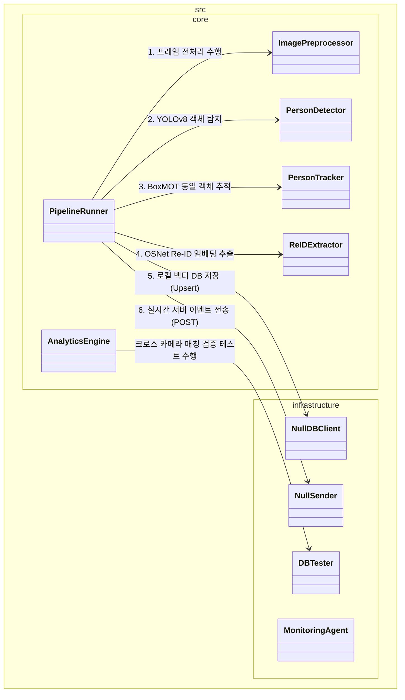
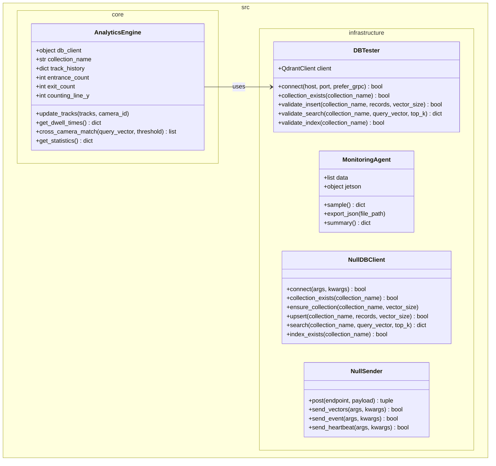

# Architecture

클래스 구조의 복잡도가 높아짐에 따라 다이어그램의 가독성을 높이기 위해 전체 구조를 **1) 전체 컴포넌트 관계 개요**, **2) 핵심 비디오 파이프라인 처리부**, **3) 분석 엔진 및 인프라 연동부**의 3가지 뷰로 나누어 설계 스펙을 제공합니다.

---

## 1. High-Level System Architecture (전체 컴포넌트 관계 개요)

시스템의 전체적인 모듈 구성과 프레임 전처리부터 탐지, 추적, 임베딩 추출, 서버/DB 전송까지의 데이터 흐름 및 상호 의존 관계를 표현한 요약 다이어그램입니다. 세부 필드와 메서드는 생략하여 모듈 간 연결 관계에 집중했습니다.



---

## 2. Core Video Pipeline (핵심 파이프라인 처리부)

입력 영상 프레임으로부터 실시간 객체 탐지, 동일 신원 추적, 고유 Re-ID 특징 벡터(Embedding) 추출을 담당하는 핵심 연산부의 클래스 구조와 관계 데이터 모델의 상세 설계입니다.


---

## 3. Analytics & Infrastructure (분석 엔진 및 인프라 연동부)

추적 데이터를 기반으로 입/퇴장 집계 및 머무름 시간 계산을 연산하는 통계 모듈과 실 하드웨어 리소스 모니터링, 외부 DB/서버의 추상화된 통신 컴포넌트의 상세 명세입니다.



---

## Jetson Orin Nano 배포 가이드 (Deployment)

하네스 엔지니어링을 통해 검증된 제품 코드(`src/`)를 실제 Jetson Orin Nano 하드웨어에 배포하고 구동하기 위한 가이드입니다.

### 1. 배포 대상 파일 추출
테스트 관련 코드를 제외하고, 순수하게 운영에 필요한 파일만 패키징합니다.
```bash
# 운영 장비로 전송할 파일 목록
- src/                    # 핵심 비즈니스 및 인프라 로직
- requirements.txt        # 의존성 목록
- Dockerfile / docker-compose.yml # 컨테이너 구동 설정
- yolov8n.pt              # (또는 변환된 .engine 파일)
```

### 2. Jetson 환경 세팅 및 의존성 설치
Jetson은 ARM64 아키텍처이므로, NVIDIA에서 제공하는 JetPack SDK(DeepStream, TensorRT 포함)가 기본 설치되어 있어야 합니다.

**로컬 환경에 직접 설치할 경우:**
```bash
# 가상 환경 생성 및 활성화
python3 -m venv .venv
source .venv/bin/activate

# 의존성 설치 (Jetson 환경에 맞춰 패키지 설치)
pip install -r requirements.txt
# jtop (Jetson 모니터링 도구) 설치
sudo -H pip install -U jetson-stats
```

**Docker를 이용할 경우 (권장):**
NVIDIA L4T(Linux for Tegra) 기반의 베이스 이미지를 사용하여 컨테이너를 구동합니다.
```bash
# Docker Compose로 Qdrant 및 파이프라인 구동
docker compose up -d
```

### 3. 모델 최적화 (TensorRT 변환)
Jetson의 GPU 및 NVDLA(딥러닝 가속기)를 최대한 활용하기 위해 YOLO 및 Re-ID 모델을 TensorRT(`.engine`) 형식으로 변환해야 합니다.
파이프라인이 최초 실행될 때 `yolov8n.pt`가 존재하면 자동으로 TensorRT 엔진(`yolov8n.engine`)으로 변환을 시도하지만, 배포 전 미리 변환해두는 것이 좋습니다.

### 4. 프로덕션 실행
`run_harness.py`는 테스트용 진입점입니다. 실제 프로덕션 환경에서는 `src/core/pipeline_runner.py`를 직접 호출하는 메인 실행 스크립트(예: `main.py`)를 작성하여 구동합니다.
