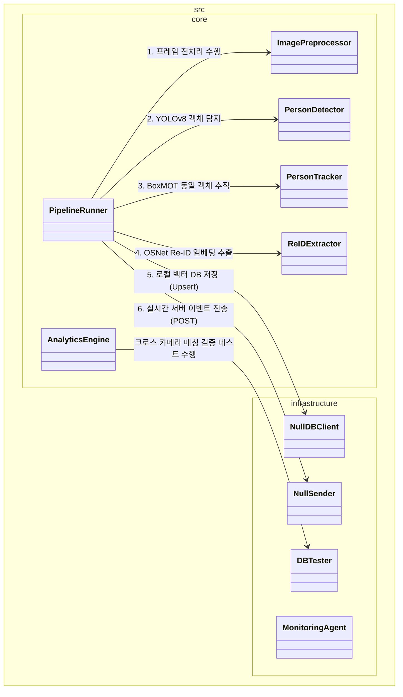
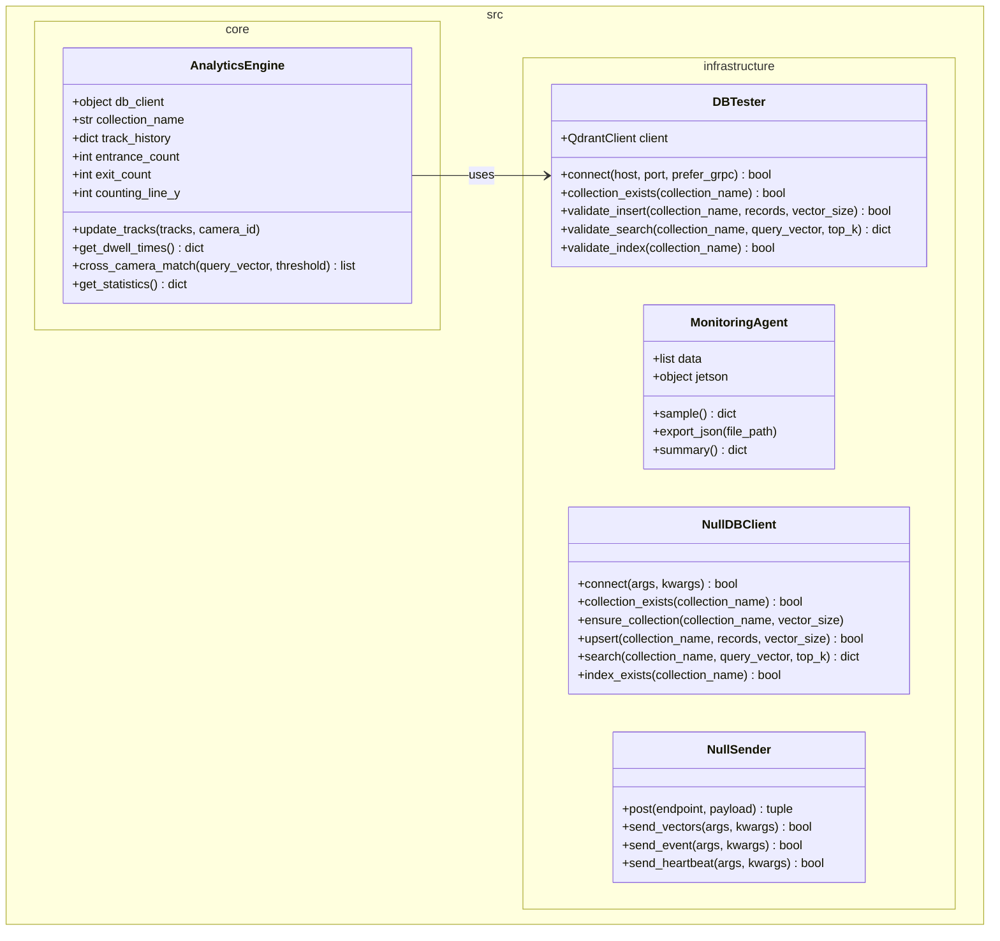
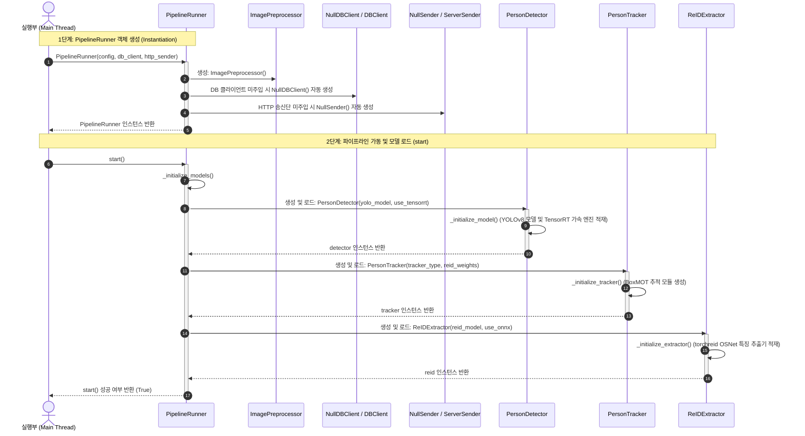

#  Edge Architecture

## 1. High-Level System Architecture (전체 컴포넌트 관계 개요)



---

## 2. Core Video Pipeline (핵심 파이프라인 처리부)

입력 영상 프레임으로부터 실시간 객체 탐지, 동일 신원 추적, 고유 Re-ID 특징 벡터(Embedding) 추출을 담당하는 핵심 연산부의 클래스 구조와 관계 데이터 모델의 상세 설계입니다.


---

## 3. Analytics & Infrastructure (분석 엔진 및 인프라 연동부)

추적 데이터를 기반으로 입/퇴장 집계 및 머무름 시간 계산을 연산하는 통계 모듈과 실 하드웨어 리소스 모니터링, 외부 DB/서버의 추상화된 통신 컴포넌트의 상세 명세입니다.



---

## 4. Initialization Sequence (객체 초기화 및 모델 적재 시퀀스)



---

## 5. Pipeline Runners (실행 오케스트레이션 아키텍처)

### 5.1. 📊 Pipeline Runners 비교 요약

| 구분 | [PipelineRunner] | [ThreadedPipelineRunner] | [MultiStreamPipelineRunner] |
| :--- | :--- | :--- | :--- |
| **스레드 모델** | 단일 스레드 (동기식) | 멀티스레드 (디코딩 스레드 1개 + 추론 워커 1개) | 멀티스레드 (카메라당 디코딩 스레드 N개 + 공유 GPU 워커 1개) |
| **대상 소스** | 이미지, 단일 비디오 파일 | 실시간 단일 카메라 (웹캠, RTSP 등 1ch) | 실시간 다중 카메라 (RTSP 등 Nch) |
| **프레임 유실** | 없음 (모든 프레임 처리) | 큐 포화 상태 시 예전 프레임 Drop | 큐 포화 상태 시 예전 프레임 Drop |
| **GPU VRAM** | 모델 1세트 로드 | 모델 1세트 로드 | **N개 채널이 모델 1세트 공유 (VRAM 절약)** |
| **핵심 목적** | 정확한 오프라인 분석 및 디버깅 | 단일 카메라 처리 FPS 극대화 및 지연 방지 | 단일 장비(임베디드)에서 다채널 효율적 감시 |

---

## 6. Jetson Orin Nano 배포 가이드 (Deployment)

하네스 엔지니어링을 통해 검증된 제품 코드(`src/`)를 실제 Jetson Orin Nano 하드웨어에 배포하고 구동하기 위한 가이드입니다.

### 6.1. 배포 대상 파일 추출
테스트 관련 코드를 제외하고, 순수하게 운영에 필요한 파일만 패키징합니다.
```bash
# 운영 장비로 전송할 파일 목록
- src/                    # 핵심 비즈니스 및 인프라 로직
- requirements.txt        # 의존성 목록
- Dockerfile / docker-compose.yml # 컨테이너 구동 설정
- yolov8n.pt              # (또는 변환된 .engine 파일)
```

### 6.2. Jetson 환경 세팅 및 의존성 설치
Jetson은 ARM64 아키텍처이므로, NVIDIA에서 제공하는 JetPack SDK(DeepStream, TensorRT 포함)가 기본 설치되어 있어야 합니다.

**로컬 환경에 직접 설치할 경우:**
```bash
# 가상 환경 생성 및 활성화
python3 -m venv .venv
source .venv/bin/activate

# 의존성 설치 (Jetson 환경에 맞춰 패키지 설치)
pip install -r requirements.txt
# jtop (Jetson 모니터링 도구) 설치
sudo -H pip install -U jetson-stats
```

**Docker를 이용할 경우 (권장):**
NVIDIA L4T(Linux for Tegra) 기반의 베이스 이미지를 사용하여 컨테이너를 구동합니다.
```bash
# Docker Compose로 Qdrant 및 파이프라인 구동
docker compose up -d
```

### 6.3. 모델 최적화 (TensorRT 변환)
Jetson의 GPU 및 NVDLA(딥러닝 가속기)를 최대한 활용하기 위해 YOLO 및 Re-ID 모델을 TensorRT(`.engine`) 형식으로 변환해야 합니다.
파이프라인이 최초 실행될 때 `yolov8n.pt`가 존재하면 자동으로 TensorRT 엔진(`yolov8n.engine`)으로 변환을 시도하지만, 배포 전 미리 변환해두는 것이 좋습니다.

### 6.4. 프로덕션 실행
`run_harness.py`는 테스트용 진입점입니다. 실제 프로덕션 환경에서는 `src/core/pipeline_runner.py`를 직접 호출하는 메인 실행 스크립트(예: `main.py`)를 작성하여 구동합니다.

---

## 7. Design Rationale (설계 근거)

### 7.1. Initialization Sequence (초기화 시퀀스 분리)

`PipelineRunner` 클래스(`pipeline_runner.py`)는 객체 인스턴스 생성(`__init__`)과 실제 기동(`start`) 단계를 엄격히 분리하여 설계했습니다. 분리 설계의 핵심 이유는 다음과 같습니다.

1. **자원 효율성 및 지연 로딩 (Lazy Loading & Resource Management)**
   - **생성자(`__init__`)**: `ImagePreprocessor`, `NullDBClient`, `NullSender`와 같이 가볍고 상태가 필요 없는 유틸리티나 Null Object들을 주입 및 초기화합니다.
   - **기동 함수(`start()`)**: `PersonDetector` (YOLOv8), `PersonTracker`, `ReIDExtractor` (OSNet) 등 무겁고 하드웨어 자원을 극도로 소모하는 실질적 딥러닝 연산 모듈들을 메모리에 로드합니다.
   - 단지 객체를 선언하거나 구성 조회를 위해 인스턴스를 생성했을 뿐인데 딥러닝 모델이 즉시 로드되어 메모리를 점유해 버리면 비효율적인 메모리 낭비와 불필요한 기동 지연이 발생하기 때문입니다.

2. **예외 처리와 시스템 견고성 (Robust Error Handling)**
   - 딥러닝 가중치 로드나 CUDA 가속 엔진(TensorRT) 로드는 GPU 메모리 부족(OOM), 하드웨어 오차, 모델 파일 유실 등 런타임 환경에서 **실패할 확률이 가장 높은 구역**입니다.
   - 이 무거운 적재 과정을 생성자 바깥의 `start()` 함수 내에서 명확하게 수행함으로써, 예외 발생 시 개별 복구(Fall-back) 로직 적용 및 명확한 장애 원인 로깅 처리를 안전하게 수행할 수 있습니다.

3. **동적 구성(Dynamic Configuration) 및 의존성 주입의 유연성**
   - 생성자 호출 시점(`__init__`)에는 설정 딕셔너리와 기본 인프라 의존성을 주입받아 객체 틀을 구성하지만, 실제 서비스 구동 직전까지 구성을 자유롭게 변경할 기회를 가집니다.
   - 가령 기동 직전에 가중치 파일 경로를 동적으로 바꾸거나 특정 가속 엔진(TensorRT 등) 사용 여부를 동적으로 확정한 다음, 최종 검증된 설정 상태를 바탕으로 `start()`를 실행해 안정적인 동작을 보장합니다.

4. **객체의 생명주기 제어 (Lifecycle Control: Start/Stop/Restart)**
   - 객체 자체를 매번 메모리 상에서 파괴하고 새로 할당하는 방식은 Garbage Collector(GC) 오버헤드와 힙 메모리 파편화 면에서 시스템에 악영향을 줍니다.
   - `PipelineRunner` 객체는 메모리에 영속적으로 유지하되, 필요한 경우 `stop()`을 호출해 VRAM 등의 하드웨어 리소스를 안전하게 반환하고, 재설정 후 다시 `start()`를 재호출하여 구동 환경을 갱신하는 수명 관리가 가능합니다.

5. **단위 테스트 용이성 (Testability & Mocking)**
   - 테스트 코드 작성 시 실제 GPU 메모리 할당 및 가중치 파일 로딩 없이, 가벼운 설정 검증과 `Null Object` 인터페이스 바인딩 확인 등 단위 테스트를 단 수 밀리초(ms) 단위로 빠르고 가볍게 수행하기 위해 분리된 초기화 시퀀스가 절대적으로 유리합니다.
