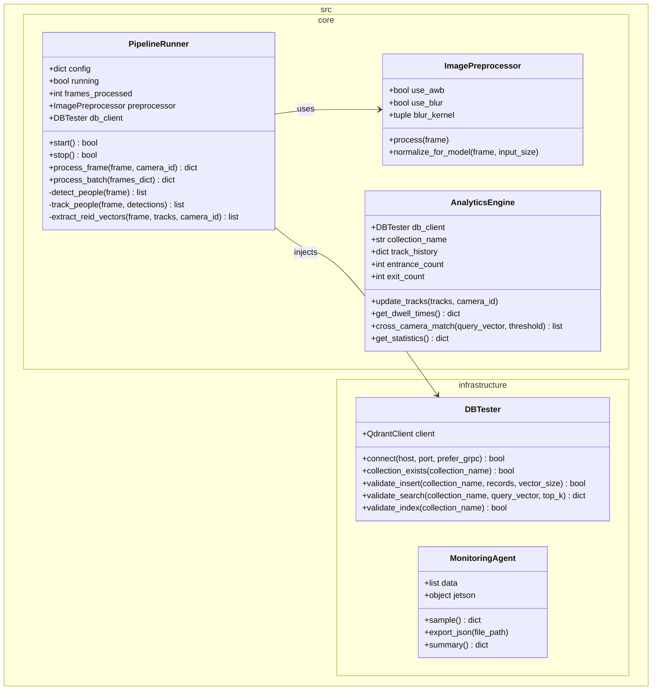

# Architecture

## src/ Class Diagram



## Jetson Orin Nano 배포 가이드 (Deployment)

하네스 엔지니어링을 통해 검증된 제품 코드(`src/`)를 실제 Jetson Orin Nano 하드웨어에 배포하고 구동하기 위한 가이드입니다.

### 1. 배포 대상 파일 추출
테스트 관련 코드를 제외하고, 순수하게 운영에 필요한 파일만 패키징합니다.
```bash
# 운영 장비로 전송할 파일 목록
- src/                    # 핵심 비즈니스 및 인프라 로직
- requirements.txt        # 의존성 목록
- Dockerfile / docker-compose.yml # 컨테이너 구동 설정
- yolov8n.pt              # (또는 변환된 .engine 파일)
```

### 2. Jetson 환경 세팅 및 의존성 설치
Jetson은 ARM64 아키텍처이므로, NVIDIA에서 제공하는 JetPack SDK(DeepStream, TensorRT 포함)가 기본 설치되어 있어야 합니다.

**로컬 환경에 직접 설치할 경우:**
```bash
# 가상 환경 생성 및 활성화
python3 -m venv .venv
source .venv/bin/activate

# 의존성 설치 (Jetson 환경에 맞춰 패키지 설치)
pip install -r requirements.txt
# jtop (Jetson 모니터링 도구) 설치
sudo -H pip install -U jetson-stats
```

**Docker를 이용할 경우 (권장):**
NVIDIA L4T(Linux for Tegra) 기반의 베이스 이미지를 사용하여 컨테이너를 구동합니다.
```bash
# Docker Compose로 Qdrant 및 파이프라인 구동
docker compose up -d
```

### 3. 모델 최적화 (TensorRT 변환)
Jetson의 GPU 및 NVDLA(딥러닝 가속기)를 최대한 활용하기 위해 YOLO 및 Re-ID 모델을 TensorRT(`.engine`) 형식으로 변환해야 합니다.
파이프라인이 최초 실행될 때 `yolov8n.pt`가 존재하면 자동으로 TensorRT 엔진(`yolov8n.engine`)으로 변환을 시도하지만, 배포 전 미리 변환해두는 것이 좋습니다.

### 4. 프로덕션 실행
`run_harness.py`는 테스트용 진입점입니다. 실제 프로덕션 환경에서는 `src/core/pipeline_runner.py`를 직접 호출하는 메인 실행 스크립트(예: `main.py`)를 작성하여 구동합니다.
