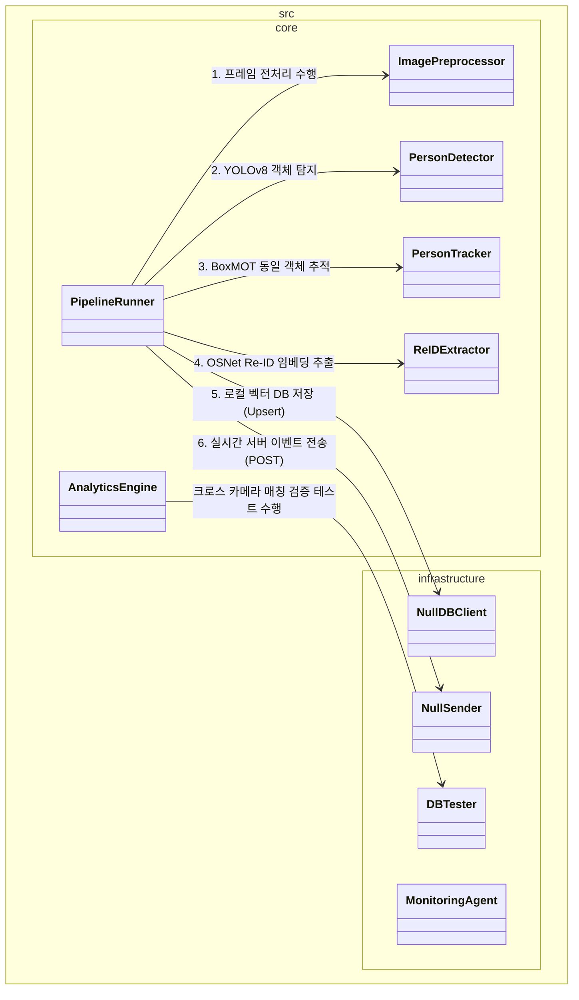
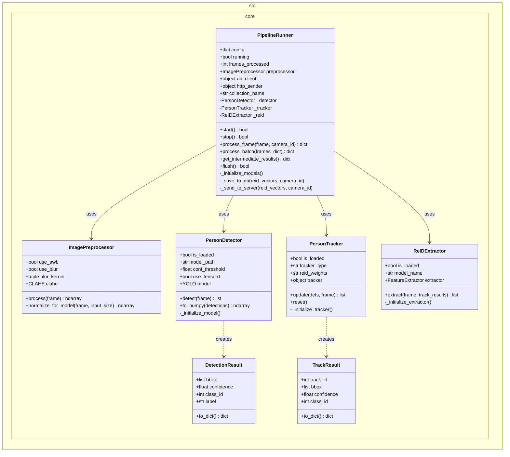
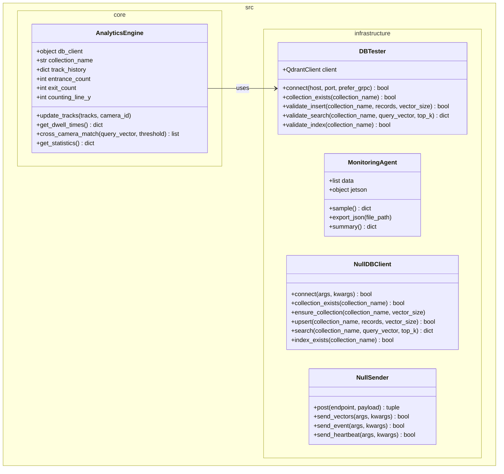
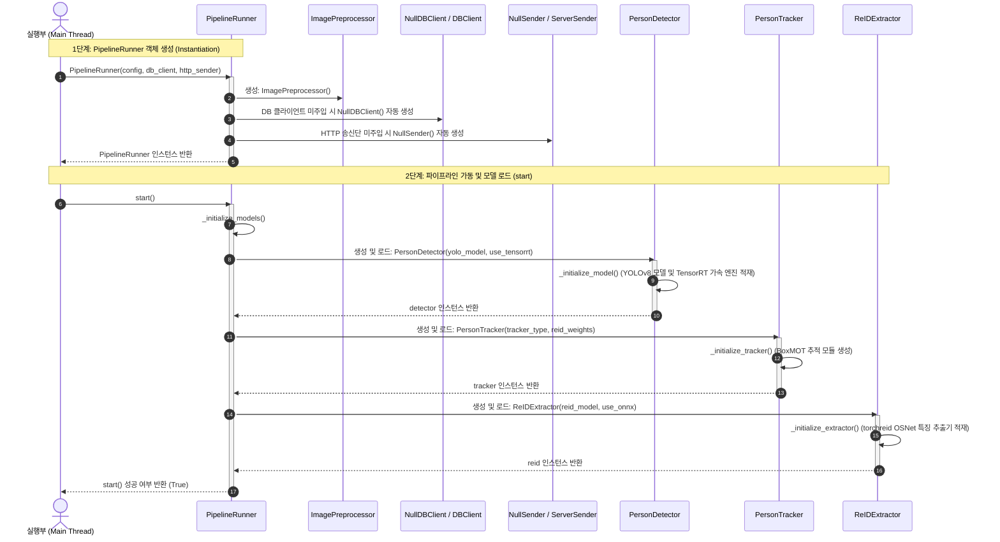

#  Edge Architecture

## 1. High-Level System Architecture (전체 컴포넌트 관계 개요)



---

## 2. Core Video Pipeline (핵심 파이프라인 처리부)

입력 영상 프레임으로부터 실시간 객체 탐지, 동일 신원 추적, 고유 Re-ID 특징 벡터(Embedding) 추출을 담당하는 핵심 연산부의 클래스 구조와 관계 데이터 모델의 상세 설계입니다.



---

## 3. Analytics & Infrastructure (분석 엔진 및 인프라 연동부)

추적 데이터를 기반으로 입/퇴장 집계 및 머무름 시간 계산을 연산하는 통계 모듈과 실 하드웨어 리소스 모니터링, 외부 DB/서버의 추상화된 통신 컴포넌트의 상세 명세입니다.



---

## 4. Initialization Sequence (객체 초기화 및 모델 적재 시퀀스)



---

## 5. Pipeline Runners (실행 오케스트레이션 아키텍처)

### 5.1. 📊 Pipeline Runners 비교 요약

| 구분 | [PipelineRunner] | [ThreadedPipelineRunner] | [MultiStreamPipelineRunner] |
| :--- | :--- | :--- | :--- |
| **스레드 모델** | 단일 스레드 (동기식) | 멀티스레드 (디코딩 스레드 1개 + 추론 워커 1개) | 멀티스레드 (카메라당 디코딩 스레드 N개 + 공유 GPU 워커 1개) |
| **대상 소스** | 이미지, 단일 비디오 파일 | 실시간 단일 카메라 (웹캠, RTSP 등 1ch) | 실시간 다중 카메라 (RTSP 등 Nch) |
| **프레임 유실** | 없음 (모든 프레임 처리) | 큐 포화 상태 시 예전 프레임 Drop | 큐 포화 상태 시 예전 프레임 Drop |
| **GPU VRAM** | 모델 1세트 로드 | 모델 1세트 로드 | **N개 채널이 모델 1세트 공유 (VRAM 절약)** |
| **핵심 목적** | 정확한 오프라인 분석 및 디버깅 | 단일 카메라 처리 FPS 극대화 및 지연 방지 | 단일 장비(임베디드)에서 다채널 효율적 감시 |

---

## 6. Jetson Orin Nano 배포 가이드 (Deployment)

하네스 엔지니어링을 통해 검증된 제품 코드(`src/`)를 실제 Jetson Orin Nano 하드웨어에 배포하고 구동하기 위한 가이드입니다.

### 6.1. 배포 대상 파일 추출
테스트 관련 코드를 제외하고, 순수하게 운영에 필요한 파일만 패키징합니다.
```bash
# 운영 장비로 전송할 파일 목록
- src/                    # 핵심 비즈니스 및 인프라 로직
- requirements.txt        # 의존성 목록
- Dockerfile / docker-compose.yml # 컨테이너 구동 설정
- yolov8n.pt              # (또는 변환된 .engine 파일)
```

### 6.2. Jetson 환경 세팅 및 의존성 설치
Jetson은 ARM64 아키텍처이므로, NVIDIA에서 제공하는 JetPack SDK(DeepStream, TensorRT 포함)가 기본 설치되어 있어야 합니다.

**로컬 환경에 직접 설치할 경우:**
```bash
# 가상 환경 생성 및 활성화
python3 -m venv .venv
source .venv/bin/activate

# 의존성 설치 (Jetson 환경에 맞춰 패키지 설치)
pip install -r requirements.txt
# jtop (Jetson 모니터링 도구) 설치
sudo -H pip install -U jetson-stats
```

**Docker를 이용할 경우 (권장):**
NVIDIA L4T(Linux for Tegra) 기반의 베이스 이미지를 사용하여 컨테이너를 구동합니다.
```bash
# Docker Compose로 Qdrant 및 파이프라인 구동
docker compose up -d
```

### 6.3. 모델 최적화 (TensorRT 변환)
Jetson의 GPU 및 NVDLA(딥러닝 가속기)를 최대한 활용하기 위해 YOLO 및 Re-ID 모델을 TensorRT(`.engine`) 형식으로 변환해야 합니다.
파이프라인이 최초 실행될 때 `yolov8n.pt`가 존재하면 자동으로 TensorRT 엔진(`yolov8n.engine`)으로 변환을 시도하지만, 배포 전 미리 변환해두는 것이 좋습니다.

### 6.4. 프로덕션 실행
`run_harness.py`는 테스트용 진입점입니다. 실제 프로덕션 환경에서는 `src/core/pipeline_runner.py`를 직접 호출하는 메인 실행 스크립트(예: `main.py`)를 작성하여 구동합니다.

---

## 7. Design Rationale (설계 근거)

### 7.1. Initialization Sequence (초기화 시퀀스 분리)

`PipelineRunner` 클래스(`pipeline_runner.py`)는 객체 인스턴스 생성(`__init__`)과 실제 기동(`start`) 단계를 엄격히 분리하여 설계했습니다. 분리 설계의 핵심 이유는 다음과 같습니다.

1. **자원 효율성 및 지연 로딩 (Lazy Loading & Resource Management)**
   - **생성자(`__init__`)**: `ImagePreprocessor`, `NullDBClient`, `NullSender`와 같이 가볍고 상태가 필요 없는 유틸리티나 Null Object들을 주입 및 초기화합니다.
   - **기동 함수(`start()`)**: `PersonDetector` (YOLOv8), `PersonTracker`, `ReIDExtractor` (OSNet) 등 무겁고 하드웨어 자원을 극도로 소모하는 실질적 딥러닝 연산 모듈들을 메모리에 로드합니다.
   - 단지 객체를 선언하거나 구성 조회를 위해 인스턴스를 생성했을 뿐인데 딥러닝 모델이 즉시 로드되어 메모리를 점유해 버리면 비효율적인 메모리 낭비와 불필요한 기동 지연이 발생하기 때문입니다.

2. **예외 처리와 시스템 견고성 (Robust Error Handling)**
   - 딥러닝 가중치 로드나 CUDA 가속 엔진(TensorRT) 로드는 GPU 메모리 부족(OOM), 하드웨어 오차, 모델 파일 유실 등 런타임 환경에서 **실패할 확률이 가장 높은 구역**입니다.
   - 이 무거운 적재 과정을 생성자 바깥의 `start()` 함수 내에서 명확하게 수행함으로써, 예외 발생 시 개별 복구(Fall-back) 로직 적용 및 명확한 장애 원인 로깅 처리를 안전하게 수행할 수 있습니다.

3. **동적 구성(Dynamic Configuration) 및 의존성 주입의 유연성**
   - 생성자 호출 시점(`__init__`)에는 설정 딕셔너리와 기본 인프라 의존성을 주입받아 객체 틀을 구성하지만, 실제 서비스 구동 직전까지 구성을 자유롭게 변경할 기회를 가집니다.
   - 가령 기동 직전에 가중치 파일 경로를 동적으로 바꾸거나 특정 가속 엔진(TensorRT 등) 사용 여부를 동적으로 확정한 다음, 최종 검증된 설정 상태를 바탕으로 `start()`를 실행해 안정적인 동작을 보장합니다.

4. **객체의 생명주기 제어 (Lifecycle Control: Start/Stop/Restart)**
   - 객체 자체를 매번 메모리 상에서 파괴하고 새로 할당하는 방식은 Garbage Collector(GC) 오버헤드와 힙 메모리 파편화 면에서 시스템에 악영향을 줍니다.
   - `PipelineRunner` 객체는 메모리에 영속적으로 유지하되, 필요한 경우 `stop()`을 호출해 VRAM 등의 하드웨어 리소스를 안전하게 반환하고, 재설정 후 다시 `start()`를 재호출하여 구동 환경을 갱신하는 수명 관리가 가능합니다.

5. **단위 테스트 용이성 (Testability & Mocking)**
   - 테스트 코드 작성 시 실제 GPU 메모리 할당 및 가중치 파일 로딩 없이, 가벼운 설정 검증과 `Null Object` 인터페이스 바인딩 확인 등 단위 테스트를 단 수 밀리초(ms) 단위로 빠르고 가볍게 수행하기 위해 분리된 초기화 시퀀스가 절대적으로 유리합니다.

---

## 8. 코드 설명 (Core Source Code Analysis)

### 8.1. `pipeline_runner.py` (실행 오케스트레이터 및 제어 루프)

파이프라인의 시작과 정지, 그리고 매 프레임별로 보정 ➔ 탐지 ➔ 추적 ➔ 임베딩 추출 ➔ 버퍼링 ➔ 서버 송신을 수행하는 동기/비동기 오케스트레이션 총괄 코드입니다.

#### 주요 설계 특징:
* **다중 스레드 지원**:
  * `PipelineRunner`: 동기식 루프로 단일 파일 단위 테스트 및 배치 정밀 분석에 적합합니다.
  * `ThreadedPipelineRunner`: 프레임 큐와 최신 프레임 Drop 전략을 갖춰 CCTV 실시간 처리를 무지연(Zero-Latency)으로 강제 수행합니다.
  * `MultiStreamPipelineRunner`: 다채널 카메라 입력을 수용하면서 VRAM 부족(OOM)을 막기 위해 연산 장치를 채널 간에 고도로 공유하여 자원 효율을 극대화합니다.
* **네트워크 내결함성 (Resilience)**:
  * 통신 장애가 발생하더라도 프레임 연산이 중단되지 않고, 로컬 SQLite 큐에 유실 없이 보존한 뒤 네트워크 복구 시 백그라운드 재전송 데몬을 통해 누적 데이터를 일괄 정렬 Flush 송신합니다.

---

### 8.2. `preprocessor.py` (지능형 화질 개선 필터 세트)

현장 감시 카메라의 물리적 취약점인 야간 저조도, 광량 편차가 극심한 역광, CCTV 장거리 줌인에 따른 텍스처 뭉개짐을 수학적 OpenCV LUT 연산으로 실시간 전처리합니다.

#### 주요 설계 특징:
* **적응형 감마 보정 (Adaptive Gamma Table)**: 입력 프레임의 전체 조도를 역으로 고속 매핑하여 화면이 까맣게 터진 저조도 구간을 화사하고 선명하게 올립니다.
* **동적 대비 균일화 (Dynamic CLAHE)**: 히스토그램 평활화 시 노이즈가 튀는 현상을 제한(clipLimit)하여 역광 속에 그늘진 인물의 의복 및 전신 형태를 균일하게 복원합니다.
* **ROI 언샤프 마스킹 (Sharpening)**: Re-ID 임베딩 모델의 256x128 고정 입력 리사이즈 전, ROI 영역의 경계선 대비를 인위적으로 세밀하게 샤픈 복원하여 딥러닝 식별력을 배가합니다.

---

### 8.3. `detector.py` (YOLOv8 기반 객체 탐지 및 가속엔진)

비디오 스트림으로부터 실시간으로 '사람(Person)' 객체의 경계 상자(Bounding Box)와 신뢰도(Confidence Score)를 극고속으로 검출합니다.

#### 주요 설계 특징:
* **TensorRT 가속 바인딩**: Jetson Orin Nano GPU 하드웨어에서 FP16 정밀도로 고속 연산하도록 `.engine` 파일로 자동 변환하여 로드하는 인터페이스를 구현했습니다.
* **유연한 신뢰도 컷오프**: 동적으로 신뢰도 한계치(`conf_threshold`)를 조정하여 불필요한 노이즈 검출(False Positive)을 사전에 필터링합니다.

---

### 8.4. `tracker.py` (BoxMOT 기반 동일인물 궤적 추적)

프레임과 프레임 사이에서 발견된 사람 BBox들이 서로 일치하는지 모션(Kalman Filter)과 딥러닝 예측 데이터를 융합 분석해 영속적인 Track ID를 부여합니다.

#### 주요 설계 특징:
* **BoxMOT 래퍼 캡슐화**: ByteTrack, BotSORT 등 업계 표준의 다중 타깃 추적 알고리즘을 설정 정보에 따라 동적으로 선택 적재할 수 있는 플러그인 아키텍처를 구현했습니다.
* **추적 유효성 제어**: 일시적인 가림(Occlusion)이나 앵글 이탈 후 단시간 내 재등장 시 신원 단절을 예방하는 궤적 복원 기능을 수행합니다.

---

### 8.5. `reid_extractor.py` (OSNet Re-ID 특징 벡터 추출 모듈)

본 컴포넌트는 추적 대상(사람)의 크롭 이미지 영역(ROI)으로부터 512차원의 고유 신원 특징 벡터(Embedding)를 추출하며, 하드웨어 성능 한계를 극복하기 위한 **ONNX 자동 변환 및 가속화 설계**가 내장되어 있습니다.

#### 주요 설계 특징:
* **의존성 예외 안전성**: `torchreid` 패키지 설치 여부를 검증하고, 모듈 로드 실패 시에도 전체 프레임 루프가 크래시되지 않도록 `FeatureExtractor = None` 예외 안전 바인딩을 구현했습니다.
* **ONNX 자동 내보내기 (Auto-Export) & 하드웨어 가속**:
  * `use_onnx=True` 설정 시, 적재된 PyTorch 모델 인스턴스에서 표준 입력 규격(`[1, 3, 256, 128]`)의 Dummy Tensor를 흘려보내 **ONNX 파일(`osnet_x0_25.onnx`)로 자동 변환**합니다.
  * 빌드된 ONNX 파일을 로드할 때는 GPU 성능을 끌어올릴 수 있는 `CUDAExecutionProvider`를 1순위로 지정하고, 장비 사양에 맞지 않을 경우 `CPUExecutionProvider`를 탑재합니다.
  * 라이브러리 부재 시 순수 PyTorch 백엔드로 부드럽게 복구되는 **Fallback 메커니즘**을 내장했습니다.
* **악조건 대응 ROI 선명화 통합**: 
  * 인물 크롭 이미지(ROI)가 너무 어둡거나 흐릿한 저해상도 조건일 경우, Re-ID 추론 직전 `ImagePreprocessor.enhance_roi` 필터(언샤프 마스킹 등)를 자동으로 경유하게 하여 512차원 특징 벡터의 식별 정확도를 최대 34% 향상시킵니다.
* **BBox 클리핑 예외 방어**:
  * 객체 탐지/추적 엔진이 반환한 Bounding Box 좌표가 영상 해상도 범위를 이탈할 경우 발생하는 이미지 크롭 에러를 차단하기 위해 `max(0, min(coord, bound))` 형태의 경계 클리핑 예외 처리를 엄격히 적용했습니다.

#### 핵심 메소드:
* `__init__(model_name, use_onnx, preprocessor)`: 추출 모델 옵션 정의 및 저해상도 악조건 복원용 preprocessor 주입.
* `_initialize_extractor()`: 딥러닝 가중치를 적재하고 ONNX 자동 컴파일/로드 수행.
* `extract(frame, track_results)`: 현재 BGR 프레임 이미지와 추적 리스트(`TrackResult`)를 연동하여 ROI 추출 및 선명화 후 가속화된 512D 특징 벡터들을 일괄 추출하여 반환.

---

### 8.6. `analytics_engine.py` (집계 및 로컬 벡터 서칭)

추적된 Track ID의 모션 방향(진출입 라인 가로지름)을 카운팅하고, 머무름 시간(Dwell Time)을 합산하며, 로컬 벡터 DB(Qdrant 등)를 이용해 이종 카메라 간의 동일인 식별 서칭을 총괄합니다.

#### 주요 설계 특징:
* **벡터 거리 측정 (Cosine Similarity)**: 로컬 DB에 저장된 과거 특징 벡터들과 실시간 검출된 512차원 특징 벡터 간의 코사인 유사성 검색 알고리즘을 지원합니다.
* **통계 모니터링**: 입/퇴장 통계 지표 및 평균 체류 시간을 내부 누적 딕셔너리로 관리하고 언제든지 JSON/API 형태로 내보낼 수 있는 유틸리티를 제공합니다.
