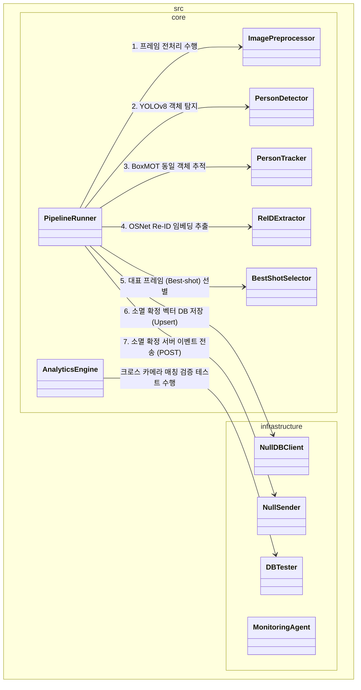
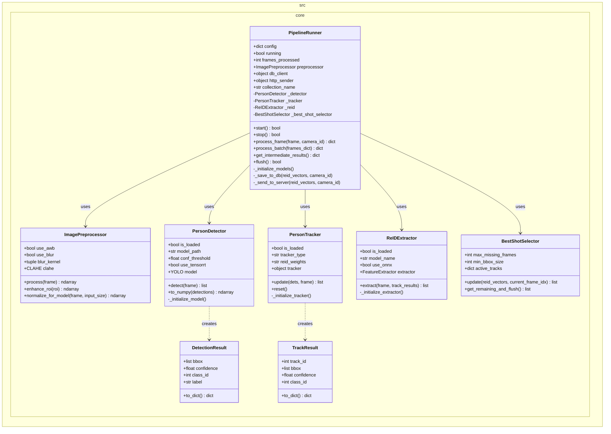
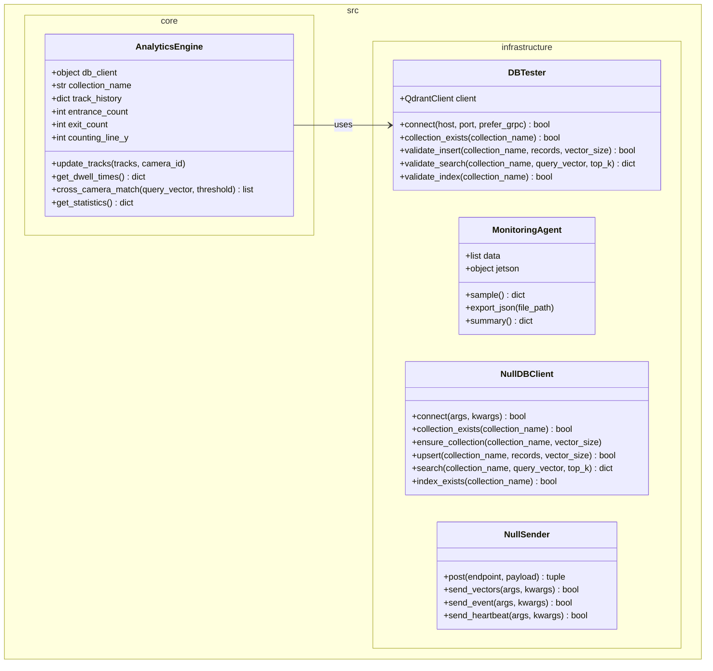
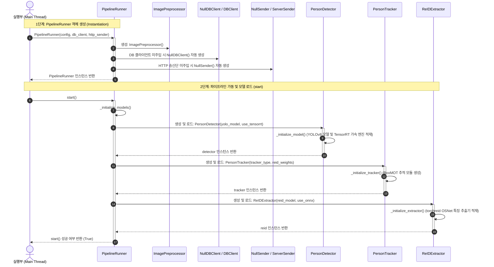
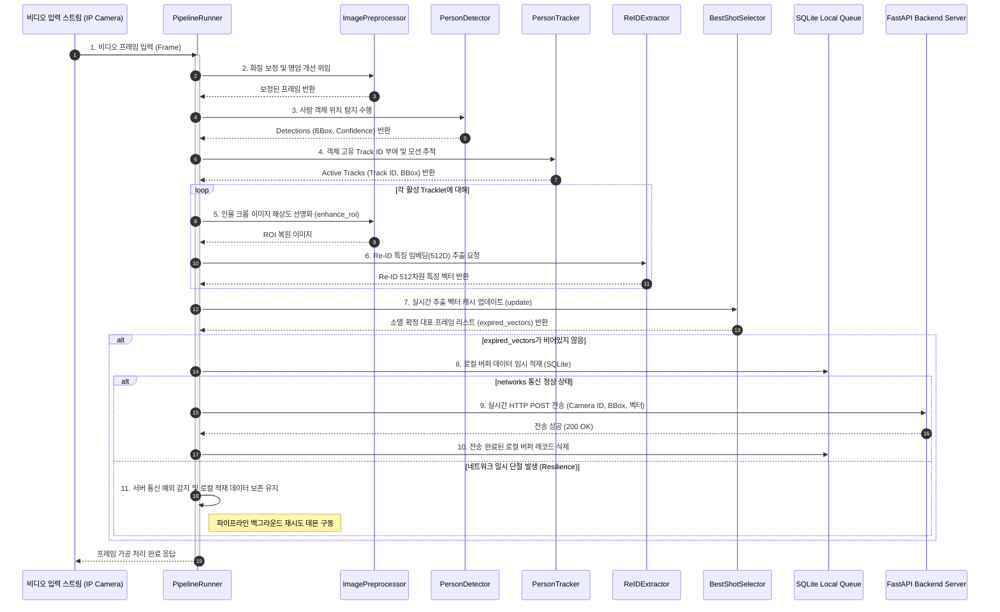
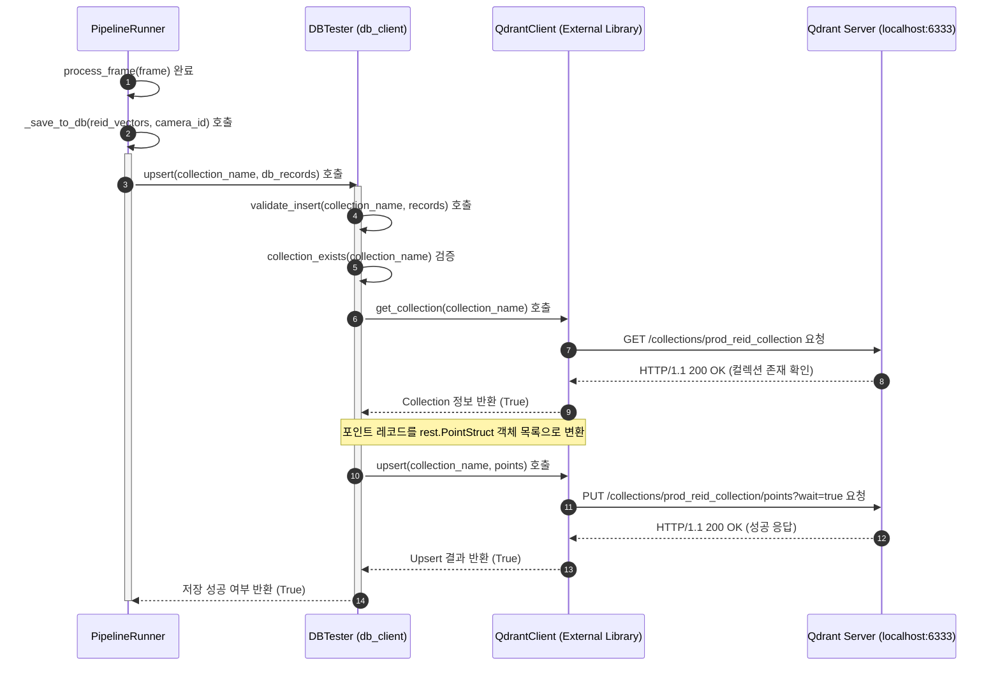

# EYE-D Edge Design (에지 아키텍처 및 파이프라인 설계)

본 문서는 **EYE-D** 시스템의 현장 카메라 및 임베디드 단(Edge Device, 예: Jetson Orin Nano)에서 실시간으로 사람을 탐지하고, 추적하며, 특징 벡터(Re-ID Embedding)를 추출하여 로컬 데이터베이스와 서버로 전송하는 **Edge Zone AI 파이프라인**의 전체 아키텍처와 주요 동작 메커니즘을 설명하는 종합 기술 문서입니다.

---

## 목차 (Table of Contents)

1. [High-Level System Architecture (전체 컴포넌트 구조)](#1-high-level-system-architecture-전체-컴포넌트-구조)
2. [Core Video Pipeline (핵심 파이프라인 처리부)](#2-core-video-pipeline-핵심-파이프라인-처리부)
    - [2.1. 클래스 다이어그램 (Core 상세)](#21-클래스-다이어그램-core-상세)
    - [2.2. 핵심 클래스별 기능 및 역할](#22-핵심-클래스별-기능-및-역할)
3. [Analytics & Infrastructure (분석 엔진 및 인프라 연동부)](#3-analytics--infrastructure-분석-엔진-및-인프라-연동부)
    - [3.1. 클래스 다이어그램 (Infra 상세)](#31-클래스-다이어그램-infra-상세)
4. [Core Sequence Diagrams (핵심 동작 시퀀스)](#4-core-sequence-diagrams-핵심-동작-시퀀스)
    - [4.1. 객체 초기화 및 모델 적재 시퀀스 (Initialization Sequence)](#41-객체-초기화-및-모델-적재-시퀀스-initialization-sequence)
    - [4.2. 비디오 프레임 처리 및 전송 시퀀스 (Processing & Sending Sequence)](#42-비디오-프레임-처리-및-전송-시퀀스-processing--sending-sequence)
    - [4.3. 로컬 Qdrant 벡터 DB 적재 시퀀스 (Local Vector DB Upsert Sequence)](#43-로컬-qdrant-벡터-db-적재-시퀀스-local-vector-db-upsert-sequence)
5. [Pipeline Runners (실행 오케스트레이션 아키텍처)](#5-pipeline-runners-실행-오케스트레이션-아키텍처)
    - [5.1. Pipeline Runners 비교 요약](#51-pipeline-runners-비교-요약)
6. [Network Resilience & Offline Buffering (네트워크 복원력)](#6-network-resilience--offline-buffering-네트워크-복원력)
7. [Jetson Orin Nano 배포 가이드 (Deployment)](#7-jetson-orin-nano-배포-가이드-deployment)
    - [7.1. 배포 대상 파일 추출](#71-배포-대상-파일-추출)
    - [7.2. Jetson 환경 세팅 및 의존성 설치](#72-jetson-환경-세팅-및-의존성-설치)
    - [7.3. 모델 최적화 (TensorRT 변환)](#73-모델-최적화-tensorrt-변환)
    - [7.4. 프로덕션 실행](#74-프로덕션-실행)
8. [Design Rationale (설계적 결정 및 핵심 근거)](#8-design-rationale-설계적-결정-및-핵심-근거)
    - [8.1. 객체 생성과 모델 기동의 엄격한 분리](#81-객체-생성__init__과-모델-기동start의-엄격한-분리)
    - [8.2. Re-ID 특징 벡터 전송 최적화](#82-re-id-특징-벡터-전송-최적화-re-id-vector-transmission-optimization)
    - [8.3. 에지-서버 간 동일 Re-ID 모델 동기화 및 관리 구조](#83-에지-서버-간-동일-re-id-모델-동기화-및-관리-구조)
    - [8.4. 다중 스트림 환경에서의 GPU 인스턴스 공유](#84-다중-스트림-환경에서의-gpu-인스턴스-공유)
    - [8.5. 최신 프레임 보존 Drop 전략 (Frame Drop Strategy)](#85-최신-프레임-보존-drop-전략-frame-drop-strategy)
    - [8.6. ONNX 및 TensorRT 가속 파이프라인 채택](#86-onnx-및-tensorrt-가속-파이프라인-채택)
    - [8.7. 컨테이너 이미지 빌드 전략 및 아키텍처 한계 대응](#87-컨테이너-이미지-빌드-전략-및-아키텍처-한계-대응)
9. [코드 설명 (Core Source Code Analysis)](#9-코드-설명-core-source-code-analysis)
    - [9.1. pipeline_runner.py](#91-pipeline_runnerpy-실행-오케스트레이터-및-제어-루프)
    - [9.2. preprocessor.py](#92-preprocessorpy-지능형-화질-개선-필터-세트)
    - [9.3. detector.py](#93-detectorpy-yolov8-기반-객체-탐지-및-가속엔진)
    - [9.4. tracker.py](#94-trackerpy-boxmot-기반-동일인물-궤적-추적)
    - [9.5. reid_extractor.py](#95-reid_extractorpy-osnet-re-id-특징-벡터-추출-모듈)
    - [9.6. analytics_engine.py](#96-analytics_enginepy-집계-및-로컬-벡터-서칭)
    - [9.7. best_shot.py](#97-best_shotpy-대표-프레임-선별-및-전송-제어)
10. [Edge Testing & Visual Demo Verification (파이프라인 검증 체계)](#10-edge-testing--visual-demo-verification-파이프라인-검증-체계)
    - [10.1. 격리 단위 테스트 구성](#101-격리-단위-테스트-구성)
    - [10.2. 실시간 인터랙티브 데모 (visual_demo.py)](#102-실시간-인터랙티브-데모-visual_demopy)

---


## 1. High-Level System Architecture (전체 컴포넌트 구조)

Edge Zone 파이프라인은 크게 영상 프레임의 보정과 딥러닝 추론을 담당하는 **Core Video Pipeline**과 분석 데이터의 집계 및 저장/전송을 담당하는 **Analytics & Infrastructure**로 분류됩니다.



---

## 2. Core Video Pipeline (핵심 파이프라인 처리부)

입력 영상 프레임으로부터 실시간 객체 탐지, 동일 신원 추적, 고유 Re-ID 특징 벡터(Embedding) 추출을 담당하는 핵심 연산부의 클래스 구조와 관계 데이터 모델의 상세 설계입니다.

### 2.1. 클래스 다이어그램 (Core 상세)



### 2.2. 핵심 클래스별 기능 및 역할

1. **`PipelineRunner` (실행 오케스트레이션)**
   * **역할**: 비디오 입력 소스로부터 들어오는 프레임을 받아 `전처리 ➔ 객체 탐지 ➔ 객체 추적 ➔ Re-ID 임베딩 추출 ➔ 로컬 DB 저장 및 서버 전송`으로 이어지는 파이프라인의 생명주기와 전 과정을 총괄 연동하는 중앙 지휘관 클래스입니다.
   * **핵심 강점**: 모델 로딩 상태를 내부 플래그로 격리 관리하며, DB 연동 실패나 네트워크 장단절 시에도 추론 루프가 붕괴되지 않고 정상 유지되는 견고성을 제공합니다.

2. **`ImagePreprocessor` (지능형 화질 보정 엔진)**
   * **역할**: 엣지 카메라의 악조건(야간 저조도, 광량 대비가 극심한 역광, CCTV 저해상도 뭉개짐)을 극복하기 위해 입력 프레임 및 ROI(인물 검출 영역)를 수학적으로 보정합니다.
   * **주요 기법**:
     * **적응형 감마 변환 (Adaptive Gamma Correction)**: 야간 저조도 환경에서 프레임의 전체 조도를 고속 향상시킵니다.
     * **동적 clipLimit CLAHE**: 역광 환경에서 과노출/과소노출된 얼굴 및 신체 윤곽 부분의 국소 대비를 향상시킵니다.
     * **ROI Unsharp Masking (`enhance_roi`)**: Re-ID 임베딩 추출 직전, 저화질 ROI 이미지를 선명화(34% 이상 복원)하여 벡터 식별력을 최대로 끌어올립니다.

3. **`PersonDetector` (고속 객체 탐지)**
   * **역할**: 영상에서 보행자(Person)의 존재 유무 및 Bounding Box(BBox)를 실시간으로 탐지합니다.
   * **기반 기술**: Ultralytics YOLOv8을 활용하며, Jetson 환경에서 추론 프레임 레이트(FPS) 향상을 극대화하기 위해 NVIDIA GPU 전용 하드웨어 가속 기법인 **TensorRT(FP16)** 변환 엔진을 자동 적재합니다.

4. **`PersonTracker` (인격 동일 신원 추적)**
   * **역할**: YOLOv8 탐지 결과를 활용하여, 여러 프레임에 걸쳐 등장하는 동일 보행자에게 일관된 `Track ID`를 임시 부여합니다.
   * **기반 기술**: 다양한 트래커 인터페이스(ByteTrack, BotSORT 등)와 호환되는 BoxMOT 라이브러리를 바인딩해 활용하며, 단절 후 재매칭을 최소화하기 위해 칼만 필터 및 모션 예측 데이터를 최적 연동합니다.

5. **`ReIDExtractor` (512차원 특징 임베딩 추출)**
   * **역할**: 추적 엔진이 확정한 인물 영역(BBox ROI)만 정밀 크롭하여 Deep Learning 기반 Re-ID 모델(OSNet)에 통과시킨 뒤, 사람의 외형적 의복 특징 및 고유 패턴을 대표하는 **512차원의 고밀도 벡터**를 추출합니다.
   * **가속 기술**: PyTorch 기반의 순수 추론 방식과 비교해 CPU/GPU 실행 속도를 획기적으로 향상시킬 수 있는 **ONNX Runtime 하드웨어 가속** 기술을 통합 탑재했습니다. 라이브러리가 없는 환경에선 PyTorch 백엔드로 부드럽게 되돌아가는 **Fallback 안전 장치**를 내장하고 있습니다.

---

## 3. Analytics & Infrastructure (분석 엔진 및 인프라 연동부)

추적 데이터를 기반으로 입/퇴장 집계 및 머무름 시간 계산을 연산하는 통계 모듈과 실 하드웨어 리소스 모니터링, 외부 DB/서버의 추상화된 통신 컴포넌트의 상세 명세입니다.

### 3.1. 클래스 다이어그램 (Infra 상세)



---

## 4. Core Sequence Diagrams (핵심 동작 시퀀스)

### 4.1. 객체 초기화 및 모델 적재 시퀀스 (Initialization Sequence)



---

### 4.2. 비디오 프레임 처리 및 전송 시퀀스 (Processing & Sending Sequence)



---

### 4.3. 로컬 Qdrant 벡터 DB 적재 시퀀스 (Local Vector DB Upsert Sequence)



#### 상세 동작 원리 및 REST API 매핑

파이프라인이 매 프레임을 처리하여 벡터를 저장할 때 발생하는 내부 로직과 Qdrant 서버의 HTTP 통신 로그는 다음과 같이 1:1로 대응됩니다.

1. **컬렉션 존재 유무 검증 (GET 요청)**
   * **Qdrant 통신 로그**: `GET http://localhost:6333/collections/prod_reid_collection`
   * **설명**: `PipelineRunner`가 `_save_to_db`를 거쳐 `DBTester.upsert()`를 호출하면, 데이터를 저장하기 전에 해당 컬렉션이 DB에 등록되어 있는지 검사하기 위해 `DBTester.collection_exists()`를 먼저 실행합니다. 내부적으로 `self.client.get_collection()`이 가동되며 Qdrant 서버로 컬렉션의 정보 조회를 요청합니다.
   
2. **벡터 및 메타데이터 적재 (PUT 요청)**
   * **Qdrant 통신 로그**: `PUT http://localhost:6333/collections/prod_reid_collection/points?wait=true`
   * **설명**: 컬렉션 존재 여부가 확인된 후, 512차원 Re-ID 임베딩 벡터와 카메라 ID, 트랙 ID, 타임스탬프 등의 정보가 결합된 포인트 데이터들을 `rest.PointStruct` 객체 목록으로 가공합니다. 최종적으로 `self.client.upsert()`가 실행되면서 Qdrant의 포인트 적재 REST API를 `PUT` 메소드로 호출하여 데이터를 물리적으로 저장합니다.

#### Qdrant 핵심 용어 설명

Qdrant(벡터 데이터베이스)에서 사용되는 핵심 개념들은 기존 관계형 데이터베이스(RDBMS)의 구성 요소와 다음과 같이 비교할 수 있습니다.

1. **컬렉션 (Collection)**
   * **RDBMS의 테이블(Table)**과 같은 개념입니다.
   * 동일한 벡터 차원(Dimension, 예: 512차원)과 거리 측정 기준(Distance Metric, 예: Cosine)을 공유하는 고밀도 벡터 데이터의 집합소입니다.
   * 본 프로젝트에서는 `prod_reid_collection` 컬렉션을 생성해 Re-ID 특징 벡터를 관리합니다.

2. **포인트 데이터 (Point Data)**
   * **RDBMS의 행(Row) / 레코드(Record)**에 매핑되는 개념입니다.
   * Qdrant에 저장되는 실질적인 데이터 한 줄(단위)을 의미하며, 크게 세 가지 필드로 구성됩니다:
     * **ID**: 포인트의 고유 식별자 (정수 또는 UUID 형식).
     * **Vector**: 고속 탐색을 위한 512차원의 고밀도 실수형 임베딩 배열.
     * **Payload**: 벡터와 연결된 부가 메타데이터 (JSON 형태: `camera_id`, `track_id`, `timestamp` 등).

3. **`rest.PointStruct` 객체**
   * Qdrant 파이썬 SDK가 제공하는 **공식 데이터 전송 구조체 클래스**입니다.
   * 일반 파이썬 딕셔너리(`dict`) 형태의 비정형 데이터를 Qdrant API(`self.client.upsert`)가 강하게 타입 검사할 수 있도록 엄격한 객체 규격으로 감싸서 포장하는 역할을 합니다.

---

## 5. Pipeline Runners (실행 오케스트레이션 아키텍처)

임베디드 단의 한정된 리소스(예: Jetson Orin Nano의 6x ARM CPU 및 4GB/8GB VRAM 제한) 속에서 성능을 극대화하기 위해 3가지 유형의 런타임 오케스트레이터를 구축했습니다.

### 5.1. 📊 Pipeline Runners 비교 요약

| 구분 | **PipelineRunner (동기식)** | **ThreadedPipelineRunner (병렬식)** | **MultiStreamPipelineRunner (다중 카메라 공유)** |
| :--- | :--- | :--- | :--- |
| **스레드 모델** | 단일 스레드 (동기식) | 멀티스레드 (디코딩 스레드 1개 + 추론 워커 1개) | 멀티스레드 (카메라당 디코딩 스레드 N개 + 공유 GPU 워커 1개) |
| **대상 소스** | 이미지, 단일 비디오 파일 | 실시간 단일 카메라 (웹캠, RTSP 등 1ch) | 실시간 다중 카메라 (RTSP 등 Nch) |
| **프레임 유실** | 없음 (모든 프레임 처리) | **최신 프레임 보존 Drop 전략**으로 프레임 유실을 동반하더라도 극저지연 실시간성을 강제 보장 | **스레드별 Drop 큐**를 장착하여, 다채널의 디코딩 시간차가 연산 병목을 유발하는 것을 완벽 차단 |
| **GPU VRAM** | 모델 1세트 로드 (보통) | 모델 1세트 로드 (보통) | **모든 채널이 동일한 YOLO, OSNet 가용 인스턴스를 공유하므로 VRAM 사용량이 채널 수와 무관하게 1대분으로 고정** |
| **핵심 목적** | 알고리즘 정밀도 튜닝 및 단위 테스트 | 단일 카메라 처리 FPS 극대화 및 지연 방지 | 단일 장비(임베디드)에서 다채널 효율적 감시 |
| **사용 사례** | 알고리즘 정밀도 튜닝 및 단위 테스트 | 고성능 단일 스마트 감시용 | 다채널 CCTV 인프라 통합 구축형 |

---

## 6. Network Resilience & Offline Buffering (네트워크 복원력)

엣지 장비는 현장의 무선 통신 장애, 인터넷 패킷 유실 등 불안정한 외부 요인에 노출되기 쉽습니다. EYE-D Edge 파이프라인은 통신 단절에 대처하기 위해 **SQLite 기반 로컬 큐(Resilience Queue)** 방식을 구축했습니다.

1. **상시 기동 버퍼**:
   * 영상에서 추출된 `Camera ID`, `Global Track ID`, `Bounding Box`, `Timestamp`, 그리고 `512차원 Re-ID 임베딩` 데이터를 메모리 유실에 안전한 로컬 디스크 SQLite 큐 테이블에 즉시 밀어 넣습니다.
2. **트랜잭션 기반 전송**:
   * API 서버로 데이터를 무사히 송신하고 `200 OK` 응답을 확인한 레코드만 큐에서 즉각 삭제합니다.
3. **네트워크 장애 감지 및 복구**:
   * 전송 실패 시 파이프라인은 크래시 없이 백그라운드 스레드에서 주기적으로 네트워크 헬스체크 및 재전송(Batch Flush)을 시도합니다. 연결이 복원되면 누적되어 있던 로컬 SQLite 데이터를 서버 스펙에 맞게 다시 고속으로 자동 병렬 전송합니다.

---

## 7. Jetson Orin Nano 배포 가이드 (Deployment)

하네스 엔지니어링을 통해 검증된 제품 코드(`src/`)를 실제 Jetson Orin Nano 하드웨어에 배포하고 구동하기 위한 가이드입니다.

### 7.1. 배포 대상 파일 추출
테스트 관련 코드를 제외하고, 순수하게 운영에 필요한 파일만 패키징합니다.
```bash
# 운영 장비로 전송할 파일 목록
- src/                    # 핵심 비즈니스 및 인프라 로직
- requirements.txt        # 의존성 목록
- Dockerfile / docker-compose.yml # 컨테이너 구동 설정
- yolov8n.pt              # (또는 변환된 .engine 파일)
```

### 7.2. Jetson 환경 세팅 및 의존성 설치
Jetson은 ARM64 아키텍처이므로, NVIDIA에서 제공하는 JetPack SDK(DeepStream, TensorRT 포함)가 기본 설치되어 있어야 합니다.

**로컬 환경에 직접 설치할 경우:**
```bash
# 가상 환경 생성 및 활성화
python3 -m venv .venv
source .venv/bin/activate

# 의존성 설치 (Jetson 환경에 맞춰 패키지 설치)
# requirements.txt에 등록된 onnxruntime 패키지가 함께 설치됩니다.
pip install -r requirements.txt

# Jetson (CUDA 가속) 환경에서 GPU 가속을 활용하려면 onnxruntime-gpu 설치를 권장합니다.
# pip install onnxruntime-gpu

# jtop (Jetson 모니터링 도구) 설치
sudo -H pip install -U jetson-stats
```

**Docker를 이용할 경우 (권장):**
NVIDIA L4T(Linux for Tegra) 기반의 베이스 이미지를 사용하여 컨테이너를 구동합니다.
```bash
# Docker Compose로 Qdrant 및 파이프라인 구동
docker compose up -d
```

### 7.3. 모델 최적화 (TensorRT 변환)
Jetson의 GPU 및 NVDLA(딥러닝 가속기)를 최대한 활용하기 위해 YOLO 및 Re-ID 모델을 TensorRT(`.engine`) 형식으로 변환해야 합니다.
파이프라인이 최초 실행될 때 `yolov8n.pt`가 존재하면 자동으로 TensorRT 엔진(`yolov8n.engine`)으로 변환을 시도하지만, 배포 전 미리 변환해두는 것이 좋습니다.

### 7.4. 프로덕션 실행
`run_harness.py`는 테스트용 진입점입니다. 실제 프로덕션 환경에서는 `src/core/pipeline_runner.py`를 직접 호출하는 메인 실행 스크립트(예: `main.py`)를 작성하여 구동합니다.

---

## 8. Design Rationale (설계적 결정 및 핵심 근거)

### 8.1. 객체 생성(`__init__`)과 모델 기동(`start`)의 엄격한 분리

`PipelineRunner` 클래스(`pipeline_runner.py`)는 객체 인스턴스 생성(`__init__`)과 실제 기동(`start`) 단계를 엄격히 분리하여 설계했습니다. 분리 설계의 핵심 이유는 다음과 같습니다.

1. **자원 효율성 및 지연 로딩 (Lazy Loading & Resource Management)**
   - **생성자(`__init__`)**: `ImagePreprocessor`, `NullDBClient`, `NullSender`와 같이 가볍고 상태가 필요 없는 유틸리티나 Null Object들을 주입 및 초기화합니다.
   - **기동 함수(`start()`)**: `PersonDetector` (YOLOv8), `PersonTracker`, `ReIDExtractor` (OSNet) 등 무겁고 하드웨어 자원을 극도로 소모하는 실질적 딥러닝 연산 모듈들을 메모리에 로드합니다.
   - 단지 객체를 선언하거나 구성 조회를 위해 인스턴스를 생성했을 뿐인데 딥러닝 모델이 즉시 로드되어 메모리를 점유해 버리면 비효율적인 메모리 낭비와 불필요한 기동 지연이 발생하기 때문입니다.

2. **예외 처리와 시스템 견고성 (Robust Error Handling)**
   - 딥러닝 가중치 로드나 CUDA 가속 엔진(TensorRT) 로드는 GPU 메모리 부족(OOM), 하드웨어 오차, 모델 파일 유실 등 런타임 환경에서 **실패할 확률이 가장 높은 구역**입니다.
   - 이 무거운 적재 과정을 생성자 바깥의 `start()` 함수 내에서 명확하게 수행함으로써, 예외 발생 시 개별 복구(Fall-back) 로직 적용 및 명확한 장애 원인 로깅 처리를 안전하게 수행할 수 있습니다.

3. **동적 구성(Dynamic Configuration) 및 의존성 주입의 유연성**
   - 생성자 호출 시점(`__init__`)에는 설정 딕셔너리와 기본 인프라 의존성을 주입받아 객체 틀을 구성하지만, 실제 서비스 구동 직전까지 구성을 자유롭게 변경할 기회를 가집니다.
   - 가령 기동 직전에 가중치 파일 경로를 동적으로 바꾸거나 특정 가속 엔진(TensorRT 등) 사용 여부를 동적으로 확정한 다음, 최종 검증된 설정 상태를 바탕으로 `start()`를 실행해 안정적인 동작을 보장합니다.

4. **객체의 생명주기 제어 (Lifecycle Control: Start/Stop/Restart)**
   - 객체 자체를 매번 메모리 상에서 파괴하고 새로 할당하는 방식은 Garbage Collector(GC) 오버헤드와 힙 메모리 파편화 면에서 시스템에 악영향을 줍니다.
   - `PipelineRunner` 객체는 메모리에 영속적으로 유지하되, 필요한 경우 `stop()`을 호출해 VRAM 등의 하드웨어 리소스를 안전하게 반환하고, 재설정 후 다시 `start()`를 재호출하여 구동 환경을 갱신하는 수명 관리가 가능합니다.

5. **단위 테스트 용이성 (Testability & Mocking)**
   - 테스트 코드 작성 시 실제 GPU 메모리 할당 및 가중치 파일 로딩 없이, 가벼운 설정 검증과 `Null Object` 인터페이스 바인딩 확인 등 단위 테스트를 단 수 밀리초(ms) 단위로 빠르고 가볍게 수행하기 위해 분리된 초기화 시퀀스가 절대적으로 유리합니다.

---

### 8.2. Re-ID 특징 벡터 전송 최적화 (Re-ID Vector Transmission Optimization)

에지 디바이스에서 실시간으로 추출된 Re-ID 특징 벡터를 매 프레임 중앙 서버로 송신하면 대역폭 낭비와 서버의 데이터베이스 적재 과부하를 초래합니다. 이를 예방하기 위해 시스템 구축 및 스케일 아웃에 다음과 같은 최적화 전략들을 설계 근거로 반영합니다.

1. **대표 프레임 (Keyframe / Best-shot) 및 주기적 중간 전송 [구현 완료 - Done]**
   - 동일 인물(동일 Track ID)에 대해 매 프레임 벡터를 보내는 대신, 추적 경로 상에서 객체 탐지 신뢰도(Confidence)가 가장 높고 바운딩 박스 크기가 커 해상도가 우수한 프레임을 베스트 샷(Best-shot)으로 기록합니다.
   - **주기적 중간 전송 (`send_interval_frames`)**: 추적 중인 인물이 화면에서 완전히 사라지기 전이라도, 설정된 프레임 주기(예: 150프레임)마다 확보된 최상의 대표 프레임 정보를 중간 전송합니다. 이때 `is_final = False`로 마킹하여 서버가 추적 상태를 인지하게 만듭니다.
   - **동작 스펙**: `YOLO 신뢰도 * BBox Area` 공식에 기반해 최고 스코어 프레임을 실시간 캐싱 갱신하며, 객체가 화면에서 연속 30프레임 이상 미검출 시 완전히 소멸한 것으로 판정하여 `is_final = True` 마킹과 함께 최종 1회 송출 및 메모리를 정리합니다. 최소 크기 필터(40px 미만 배제) 및 프로세스 종료 시 잔여 캐시 강제 방출(Flush) 메커니즘을 지원합니다.

2. **시간적 특징 결합 (Temporal Feature Aggregation / Pooling)**
   - 한 인물이 화면에 체류하는 동안 매 프레임 추출한 복수의 Re-ID 벡터들을 에지단에서 시간축 기반 평균(Mean Pooling) 또는 신뢰도 가중 평균(Confidence-weighted Pooling) 연산으로 정밀하게 압축하여, 트랙 종료 시점에 하나의 고품질 평균 벡터만 전송합니다.

3. **이벤트 트리거 및 상태 기반 전송 (State-based Transmission)**
   - 트랙이 처음 활성화될 때(Enter), 가상 출입 감시선(Line Crossing)을 통과할 때, 그리고 트랙이 화면에서 영구 손실될 때(Exit) 등의 주요 비즈니스 이벤트 시점에만 선택적으로 벡터를 송출합니다. 지속적인 추적 상태 공유 시에는 벡터 정보 없이 텍스트 식별 데이터만 전달합니다.

4. **에지 로컬 벡터 유사도 비교 필터링 (Similarity Thresholding)**
   - 에지 로컬 벡터 DB(Qdrant/Milvus 등)를 이용해 이전에 송신한 벡터와 현재 프레임의 벡터 간 코사인 유사도를 비교하고, 임계치(예: Cosine Similarity > 0.95)를 상회하여 거의 유사한 포즈/구도 상태이면 중복 전송을 스킵하고 보정용 차이만 전송합니다.

#### 최적화 전략별 장단점 및 도입 우선순위 비교 표 (Comparison Matrix)

| 최적화 전략 | 적용 순서 | 주요 작동 원리 | 장점 (Pros) | 단점 (Cons) | 추천 및 도입 이유 (Rationale) |
| :--- | :---: | :--- | :--- | :--- | :--- |
| **대표 프레임 선별<br>(Keyframe / Best-shot)** | **1순위 (Done)** | 추적 중인 궤적에서 최고 신뢰도/최대 해상도 BBox를 선정하여 전송 | - 개발 및 로직 복잡도가 비교적 낮음<br>- 최상의 입력 화질을 보장하여 식별력 유지 | - 트래킹이 종료되거나 유효 기간이 지날 때까지 전송 지연 발생<br>- 포즈 변화/방향 전환 시 단일 샷 한계 노출 | **가성비 최상**: 에지단 자원을 거의 사용하지 않으면서도 API 송신량을 즉시 95% 이상 획기적으로 낮출 수 있는 첫 단추입니다. |
| **이벤트 트리거<br>(State-based)** | **2순위** | 진입(Enter), 가상선 통과(Line Crossing), 퇴장(Exit) 시점에만 선택 전송 | - 불필요한 중간 상태 전송을 차단하여 대역폭 절감 최대화<br>- 서버와 DB 쓰기 부하를 실무 수준으로 경감 | - 탐지/라인 크로싱 로직이 오동작하거나 누락될 경우 해당 인물 데이터 유실 | **비즈니스 연동**: Line Crossing 등 대시보드 통계 이벤트에 직결되는 연산으로, 1순위 대표 프레임 선정과 병행하기 쉽습니다. |
| **시간적 특징 결합<br>(Temporal Pooling)** | **3순위** | 체류 기간의 여러 프레임 특징 벡터들을 시간축 평균 또는 가중 평균 압축 송출 | - 일시적 가려짐이나 노이즈 왜곡을 수학적으로 상쇄<br>- 단일 벡터 대비 가장 뛰어난 Re-ID 인식 신뢰도 | - 에지 내부 메모리 상에서 프레임별 벡터를 보존/연산하는 오버헤드<br>- 실시간성 대비 배치성 성격이 강함 | **인식 정확도 개선**: 1순위 도입 이후, 동일인 매칭 정확도가 낮아 역광/노이즈 시 오인식이 빈번할 때 고도화용으로 적용합니다. |
| **로컬 유사도 비교<br>(Similarity Thresholding)** | **4순위** | 이전 전송 벡터와 신규 벡터의 코사인 유사도를 에지단에서 계산해 중복 필터링 | - 인물의 구도, 포즈가 급변할 때만 유연하게 보정 데이터를 갱신 전송<br>- 물리적인 실시간 흐름 추적성 유지 | - 매 프레임 임베딩 벡터 간 유사도 연산 오버헤드 추가 발생<br>- 에지단 Qdrant/Milvus 의존성 증가 | **특수 목적**: 장시간 한 앵글에 고정적으로 머무르는 공간 관찰 등 동적 갱신이 필수적인 시나리오에 한해 최후순위로 구현합니다. |

---

### 8.3. 에지-서버 간 동일 Re-ID 모델 동기화 및 관리 구조
* **근거**: 에지(Jetson)와 중앙 백엔드 서버(FastAPI)가 서로 다른 종류나 가중치 버전 of OSNet 모델을 사용하게 되면, 동일한 인물을 대상으로 추출한 512차원 특징 벡터 간의 기하학적 분포와 가중치 매핑 구조가 어긋납니다.
* **구조적 솔루션**:
  1. **ONNX 포맷 표준화**: 에지와 서버 양측 환경의 PyTorch 라이브러리 버전 및 런타임 종속성 불일치를 방지하기 위해, 모델의 기본 서빙 규격을 **ONNX 파일(`.onnx`)**로 일원화합니다.
  2. **환경변수를 통한 정적 가중치 경로 바인딩**: 각 환경의 설정 파일(`.env`)에 `REID_MODEL_PATH` 환경변수를 강제 설정하고, 런타임 시 임의의 다운로드나 자동 캐싱 대신 정해진 로컬 단일 경로를 바라보게 제어합니다.
  3. **컨테이너 배포 일관성**: Docker 배포 시 호스트 머신의 공통 볼륨 영역(`/opt/eye-d/models`)을 각 컨테이너 내부로 마운트 처리하여 완벽히 일치하는 단일 모델 파일 바이너리를 동시에 물리적으로 참조하도록 구현합니다.
* **생성 및 확보 시점 (ONNX Lifecycle)**:
  * **에지(Edge) 관점**: 에지 파이프라인 최초 기동 시, `ReIDExtractor` 모듈 내부에서 실행 경로 상에 ONNX 파일(`osnet_x0_25.onnx`)의 부재를 자동 감지하면 PyTorch 가중치 파일로부터 ONNX 포맷 모델을 즉시 변환(Auto-Export) 및 디스크(어플리케이션을 구동한 현재 작업 디렉토리 바로 아래, 예: `edge/osnet_x0_25.onnx`)에 영구 보존합니다. 이후 2회차 실행부터는 변환 과정 없이 보존된 ONNX 파일만을 즉시 로드하여 GPU 가속을 적용합니다.
  * **서버(Server) 관점**: 서버는 보안 폐쇄망 대응 및 에지단 벡터 분포와의 완벽한 1:1 수치 일관성을 보장하기 위해 런타임 중에 외부 네트워크에서 모델을 다운로드받아 빌드하지 않습니다. 대신 배포 단계(CI/CD 빌드 타임 혹은 Docker 이미지 패키징)에서 에지가 검증 완료한 동일 ONNX 바이너리 파일(`osnet_x0_25.onnx`)을 코드 모듈 외부에 격리된 서버 프로젝트 루트의 지정 경로(`server/models/osnet_x0_25.onnx`)로 미리 이관 및 확보하여 배치합니다. 이후 FastAPI 기동 시점(Lifespan Startup)에 환경변수 `REID_MODEL_PATH="models/osnet_x0_25.onnx"` 값을 참조하여 해당 파일 바이너리를 RAM에 단 1회 로드 및 상주(Caching)시켜 서비스합니다.


### 8.4. 다중 스트림 환경에서의 GPU 인스턴스 공유
* **근거**: 일반적인 구현체는 채널(카메라)마다 파이프라인 객체를 별도로 띄워 GPU 할당을 난발합니다. 그러나 이 방식은 Jetson Orin Nano와 같이 4GB/8GB의 VRAM 제한이 명확한 엣지 보드에서 즉시 GPU Out of Memory (OOM) 오류를 일으킵니다. 이를 방지하고자, 각 IP 카메라는 스레드를 통해 프레임 디코딩만 맡고, 실제 추론 단계에서는 단 하나의 `PersonDetector`와 `ReIDExtractor` 인스턴스를 공유하여 순차적으로 추론 연산을 진행하게 하여 VRAM 오버헤드를 물리적 최소 단위로 억제하였습니다.

### 8.5. 최신 프레임 보존 Drop 전략 (Frame Drop Strategy)
* **근거**: 비디오 추론에서 큐에 쌓인 모든 프레임을 무조건 다 처리하려고 고집하면, 일시적 연산 부하 발생 시 카메라의 실시간 화면보다 수초에서 수십 초 늦게 처리되는 **'지연 누적 현상'**이 일어납니다. 이는 실시간 감시 시스템에서 치명적인 결함입니다. 이를 타파하고자 프레임 큐의 크기를 극도로 짧게(예: 크기 1~2) 유지하고, 새로운 프레임이 올 때 큐가 차 있다면 기존 버퍼의 프레임을 버려버림으로써 언제나 엣지 연산 장치가 **'가장 최신의 실시간 프레임'**만을 처리하도록 강제했습니다.

### 8.6. ONNX 및 TensorRT 가속 파이프라인 채택
* **근거**: 엣지 하드웨어의 저사양 CPU 코어로 딥러닝 추론을 진행하면 실시간 추론(최소 15~30 FPS)이 불가능합니다. 이를 달성하고자 YOLOv8에는 FP16 기반 **TensorRT 가속**을 바인딩하고, OSNet 특징 추출기에는 최적의 CPU/GPU 하드웨어 레지스트리를 타는 **ONNX Runtime 가속**을 동시 적용해 추론 속도를 기존 PyTorch CPU 대비 최대 4~6배 이상 끌어올렸습니다.
* **설치 요건**: 파이프라인이 정상적으로 ONNX 가속으로 동작하려면 시스템 가상환경에 `onnxruntime`(CPU 용) 또는 `onnxruntime-gpu`(Jetson/CUDA 용) 패키지가 필수적입니다. 패키지가 손상되었거나 유실된 경우 시스템은 안전하게 PyTorch 백엔드로 대체 구동(Fallback)되도록 설계되어 예외 복구력을 높였습니다.

### 8.7. 컨테이너 이미지 빌드 전략 및 아키텍처 한계 대응
* **근거 (x86_64 vs ARM64 아키텍처 불일치)**: 베이스 이미지인 NVIDIA 공식 L4T PyTorch(`nvcr.io/nvidia/l4t-pytorch`) 및 엣지 가속 라이브러리는 **ARM64(Aarch64)** 아키텍처 전용으로 빌드되어 있습니다. 일반적인 x86_64 개발 호스트 PC에서 단순 `docker build`를 시도하면 명령어 실행 단계(`RUN`)에서 `exec format error`와 함께 빌드가 즉시 실패합니다.
* **설계 및 해결 정책**:
  1. **엣지 직접 빌드 (Edge-Native Build) 권장**: 복잡한 크로스 빌드(Cross-build) 환경 설정에 따른 개발자 오버헤드와 오동작 가능성을 줄이기 위해, 소스 코드를 Jetson 장비 내부로 이동한 후 **Jetson 보드 내에서 직접 도커 이미지 빌드를 수행**하는 것을 기본 배포 프로세스로 정책화합니다.
  2. **크로스 빌드(Cross-build) 대안 제공**: 호스트 PC(Host)에서 일괄 빌드 및 배포를 원하는 엔터프라이즈 환경을 위해, 호스트 OS에 `qemu-user-static` ARM 에뮬레이터를 설치하고 `docker buildx` 도구의 `--platform linux/arm64` 옵션을 결합해 빌드한 후 `.tar.gz` 아카이브로 타겟 장비에 전송하는 대안적 이미지 이관 가이드라인을 분리 제공합니다.

---

### 8.8. 데스크톱(Desktop)과 Jetson 환경 구동 비교 및 이관 정책

에지 파이프라인을 일반 데스크톱 PC(x86_64)에서 구동할 때와 Jetson 임베디드 장비(ARM64)에서 구동할 때는 큰 틀에서의 파이프라인 아키텍처와 로직은 완전히 일치하지만, 하드웨어 특성과 아키텍처 차이에 따른 다음과 같은 설계적 차이점을 가집니다.

1. **공통점 (Architecture Consistency)**:
   - 전처리(ImagePreprocessor) ➔ 객체 탐지(PersonDetector) ➔ 객체 추적(PersonTracker) ➔ 임베딩 추출(ReIDExtractor) ➔ 로컬 큐(SQLite) 및 백그라운드 서버 전송 루프는 두 환경에서 **100% 동일하게 동작**합니다.
   - OSNet 모델의 ONNX Runtime 하드웨어 가속(GPU의 `CUDAExecutionProvider` 또는 CPU의 `CPUExecutionProvider`) 인터페이스 및 Fallback 메커니즘 역시 공통 코드로 실행됩니다.

2. **차이점 (Platform Divergence)**:
   - **CPU 아키텍처**: 데스크톱은 주로 Intel/AMD 기반의 **x86_64** 아키텍처인 반면, Jetson은 **ARM64 (Aarch64)** 아키텍처를 사용합니다. 이로 인해 도커 베이스 이미지(NVIDIA 공식 `l4t-pytorch` vs 일반 `nvidia/cuda`) 및 라이브러리 컴파일 방식이 완전히 달라집니다.
   - **TensorRT `.engine` 파일의 호환성**: TensorRT 가속 바이너리(`.engine`)는 빌드가 진행된 **당시 하드웨어의 GPU 아키텍처, SM(Streaming Multiprocessor) 개수, CUDA 코어 사양, VRAM 사양**에 강력하게 종속됩니다. 따라서 데스크톱 GPU(예: RTX 3080)에서 빌드해 둔 `.engine` 파일을 Jetson Orin Nano로 그대로 복사하여 사용할 경우 초기화 시점에 즉시 하드웨어 불일치 예외를 일으키고 크래시됩니다.
   - **이관 및 구동 정책**: 가중치(`.pt` 또는 `.onnx`) 상태의 소스 모델은 데스크톱과 Jetson 간에 자유롭게 공유/복사할 수 있지만, 최적 가속 엔진(`.engine` 또는 각 가속 벤더 세션)의 빌드 및 컴파일은 **반드시 해당 프로그램이 실행되는 실제 물리 에지 장비(데스크톱 또는 Jetson) 상에서 최초 기동 시 각각 개별적으로 수행**되어야 합니다.

---

## 9. 코드 설명 (Core Source Code Analysis)

### 9.1. `pipeline_runner.py` (실행 오케스트레이터 및 제어 루프)

파이프라인의 시작과 정지, 그리고 매 프레임별로 보정 ➔ 탐지 ➔ 추적 ➔ 임베딩 추출 ➔ 버퍼링 ➔ 서버 송신을 수행하는 동기/비동기 오케스트레이션 총괄 코드입니다.

#### 주요 설계 특징:
* **다중 스레드 지원**:
  * `PipelineRunner`: 동기식 루프로 단일 파일 단위 테스트 및 배치 정밀 분석에 적합합니다.
  * `ThreadedPipelineRunner`: 프레임 큐와 최신 프레임 Drop 전략을 갖춰 CCTV 실시간 처리를 무지연(Zero-Latency)으로 강제 수행합니다.
  * `MultiStreamPipelineRunner`: 다채널 카메라 입력을 수용하면서 VRAM 부족(OOM)을 막기 위해 연산 장치를 채널 간에 고도로 공유하여 자원 효율을 극대화합니다.
* **네트워크 내결함성 (Resilience)**:
  * 통신 장애가 발생하더라도 프레임 연산이 중단되지 않고, 로컬 SQLite 큐에 유실 없이 보존한 뒤 네트워크 복구 시 백그라운드 재전송 데몬을 통해 누적 데이터를 일괄 정렬 Flush 송신합니다.

---

### 9.2. `preprocessor.py` (지능형 화질 개선 필터 세트)

현장 감시 카메라의 물리적 취약점인 야간 저조도, 광량 편차가 극심한 역광, CCTV 장거리 줌인에 따른 텍스처 뭉개짐을 수학적 OpenCV LUT 연산으로 실시간 전처리합니다.

#### 주요 설계 특징:
* **적응형 감마 보정 (Adaptive Gamma Table)**: 입력 프레임의 전체 조도를 역으로 고속 매핑하여 화면이 까맣게 터진 저조도 구간을 화사하고 선명하게 올립니다.
* **동적 대비 균일화 (Dynamic CLAHE)**: 히스토그램 평활화 시 노이즈가 튀는 현상을 제한(clipLimit)하여 역광 속에 그늘진 인물의 의복 및 전신 형태를 균일하게 복원합니다.
* **ROI 언샤프 마스킹 (Sharpening)**: Re-ID 임베딩 모델의 256x128 고정 입력 리사이즈 전, ROI 영역의 경계선 대비를 인위적으로 세밀하게 샤픈 복원하여 딥러닝 식별력을 배가합니다.

---

### 9.3. `detector.py` (YOLOv8 기반 객체 탐지 및 가속엔진)

비디오 스트림으로부터 실시간으로 '사람(Person)' 객체의 경계 상자(Bounding Box)와 신뢰도(Confidence Score)를 극고속으로 검출합니다.

#### 주요 설계 특징:
* **TensorRT 가속 바인딩**: Jetson Orin Nano GPU 하드웨어에서 FP16 정밀도로 고속 연산하도록 `.engine` 파일로 자동 변환하여 로드하는 인터페이스를 구현했습니다.
* **유연한 신뢰도 컷오프**: 동적으로 신뢰도 한계치(`conf_threshold`)를 조정하여 불필요한 노이즈 검출(False Positive)을 사전에 필터링합니다.

---

### 9.4. `tracker.py` (BoxMOT 기반 동일인물 궤적 추적)

프레임과 프레임 사이에서 발견된 사람 BBox들이 서로 일치하는지 모션(Kalman Filter)과 딥러닝 예측 데이터를 융합 분석해 영속적인 Track ID를 부여합니다.

#### 주요 설계 특징:
* **BoxMOT 래퍼 캡슐화**: ByteTrack, BotSORT 등 업계 표준의 다중 타깃 추적 알고리즘을 설정 정보에 따라 동적으로 선택 적재할 수 있는 플러그인 아키텍처를 구현했습니다.
* **추적 유효성 제어**: 일시적인 가림(Occlusion)이나 앵글 이탈 후 단시간 내 재등장 시 신원 단절을 예방하는 궤적 복원 기능을 수행합니다.

---

### 9.5. `reid_extractor.py` (OSNet Re-ID 특징 벡터 추출 모듈)

본 컴포넌트는 추적 대상(사람)의 크롭 이미지 영역(ROI)으로부터 512차원의 고유 신원 특징 벡터(Embedding)를 추출하며, 하드웨어 성능 한계를 극복하기 위한 **ONNX 자동 변환 및 가속화 설계**가 내장되어 있습니다.

#### 주요 설계 특징:
* **의존성 예외 안전성**: `torchreid` 패키지 설치 여부를 검증하고, 모듈 로드 실패 시에도 전체 프레임 루프가 크래시되지 않도록 `FeatureExtractor = None` 예외 안전 바인딩을 구현했습니다.
* **ONNX 자동 내보내기 (Auto-Export) & 하드웨어 가속**:
  * `use_onnx=True` 설정 시, 적재된 PyTorch 모델 인스턴스에서 표준 입력 규격(`[1, 3, 256, 128]`)의 Dummy Tensor를 흘려보내 **ONNX 파일(`osnet_x0_25.onnx`)로 자동 변환**합니다.
  * 빌드된 ONNX 파일을 로드할 때는 GPU 성능을 끌어올릴 수 있는 `CUDAExecutionProvider`를 1순위로 지정하고, 장비 사양에 맞지 않을 경우 `CPUExecutionProvider`를 탑재합니다.
  * 라이브러리 부재 시 순수 PyTorch 백엔드로 부드럽게 되돌아가도록 구현되었습니다.

---

### 9.6. `analytics_engine.py` (집계 및 로컬 벡터 서칭)

추적된 Track ID의 모션 방향(진출입 라인 가로지름)을 카운팅하고, 머무름 시간(Dwell Time)을 합산하며, 로컬 벡터 DB(Qdrant 등)를 이용해 이종 카메라 간의 동일인 식별 서칭을 총괄합니다.

#### 주요 설계 특징:
* **벡터 거리 측정 (Cosine Similarity)**: 로컬 DB에 저장된 과거 특징 벡터들과 실시간 검출된 512차원 특징 벡터 간의 코사인 유사성 검색 알고리즘을 지원합니다.
* **통계 모니터링**: 입/퇴장 통계 지표 및 평균 체류 시간을 내부 누적 딕셔너리로 관리하고 언제든지 JSON/API 형태로 내보낼 수 있는 유틸리티를 제공합니다.

---

### 9.7. `best_shot.py` (대표 프레임 선별 및 전송 제어)

동일 Track ID의 궤적 내에서 프레임 품질을 동적으로 스코어링하여 최적의 대표 프레임을 캐싱하고, 객체 소멸 시점 혹은 설정된 주기마다 데이터를 전송하도록 제어하는 최적화 모듈입니다.

#### 주요 설계 특징:
* **품질 평점 공식**: `BBox 크기(Area) * YOLO 신뢰도(Confidence)` 연산을 활용해, 인물이 카메라와 가까워 해상도가 높고 판정률이 우수한 시점을 검증 및 저장합니다.
* **주기적 중간 전송 (Periodic Interval Transmission)**: `send_interval_frames` 변수 설정을 통해, 활성화 상태인 트랙이 완전히 소멸하기 전이라도 설정된 프레임 주기(예: 150프레임 = 약 5초)마다 그때까지 확보된 베스트 샷 정보를 데이터베이스와 서버로 중간 송출할 수 있어 실시간 모니터링 정밀도를 보장합니다.
* **전송 구분 플래그 (`is_final`)**: 데이터 송출 시 중간 전송 보고(`is_final = False`)와 최종 트랙 소멸/만료에 따른 전송(`is_final = True`)을 동적으로 마킹하여 서버 측이 비즈니스 로직(체류 종료 처리 등)을 정확하게 판별할 수 있도록 돕습니다.
* **미출현 만료(Aging) 구조**: `max_missing_frames` 변수를 임계치로 두어, 연속적으로 감출되지 않을 때 객체가 앵글을 벗어난 것으로 간주하고 소멸 처리하여 최종 베스트 샷을 방출하고 메모리를 정리합니다.
* **종료 시 Flush 동기화**: 메모리 누수나 데이터 누락을 완전 방어하기 위해 프로세스 중단 단계에서 모든 활성 트랙들의 베스트 샷을 강제 동기화(`is_final = True`)하여 최종 방출하는 기능을 제공합니다.

---

## 10. Edge Testing & Visual Demo Verification (파이프라인 검증 체계)

**55개 단위 테스트 세트** 및 **실시간 비주얼 상호작용 데모**를 구현하였습니다.

### 10.1. 격리 단위 테스트 구성
`edge/tests/` 하위 폴더에 독립적인 모킹(Mocking) 및 하네스 모듈을 설계하여, GPU가 없거나 로컬 네트워크가 구축되지 않은 격리된 CI/CD 환경에서도 정상적으로 아키텍처 결함을 스캔할 수 있습니다.
* **`test_best_shot.py` (5 passed)**: 대표 프레임 품질 갱신, 프레임 만료 소멸, 일괄 방출(Flush), 최소 BBox 크기 배제, 그리고 설정 프레임 주기별 중간 전송 로직의 수학적 및 시간적 무결성 검증
* **`test_null_objects.py` (20 passed)**: DB나 서버 통신 장애 상황 시 Null Object가 안전하게 가동되는지 검증
* **`test_pipeline_runner.py` (21 passed)**: 프레임 가공 동기식 루프 및 오케스트레이션 단계별 데이터 연쇄 동작 확인
* **`test_phase2_resilience.py` (4 passed)**: ONNX 가속기 유무에 따른 Fallback 기능 및 데이터 SQLite 임시 유실 대응성 추적
* **`test_phase3_multistream.py` (1 passed)**: 비동기 스레드 풀 환경에서 다채널 IP 카메라 프레임의 자율 분배 및 OOM 회피성 점검
* **`test_phase3_harsh_conditions.py` (3 passed)**: 야간, 역광, 저해상도의 수치 한계치 조건에서 CLAHE, Gamma 변환, Unsharp Masking의 유효 보정성 정밀 분석

### 10.2. 실시간 인터랙티브 데모 (`visual_demo.py`)
개발자가 화면을 보며 실시간으로 알고리즘의 동작성을 실환경 조건에서 분석할 수 있도록, 키보드 입력 인터랙션을 제공하는 시각화 도구입니다.

* **실행**: `python tools/visual_demo.py --video <영상경로>`
* **실시간 단축키 제어판**:
  * **`N` (Night Mode)**: 야간 저조도 모드를 강제로 켜서 적응형 감마 보정력(Gamma LUT) 실시간 비교.
  * **`B` (Backlight Mode)**: 역광 보정 모드를 켜서 명암 차가 높은 부위의 동적 CLAHE 보정력 비교.
  * **`S` (ROI Sharpen Mode)**: 저해상도 ROI 영역의 언샤프 마스킹 선명도 필터(`enhance_roi`) 전후 선명도 복원력 비교.
  * **`Q` 또는 `ESC`**: 윈도우 자원 및 모든 가속 라이브러리를 안전하게 회수하고 기동 정지.
