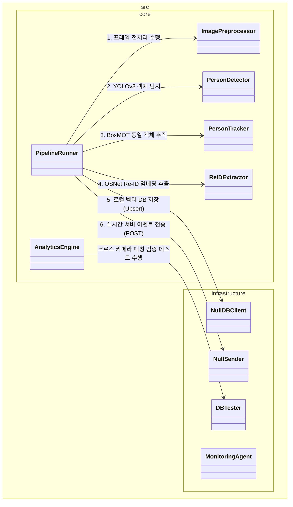
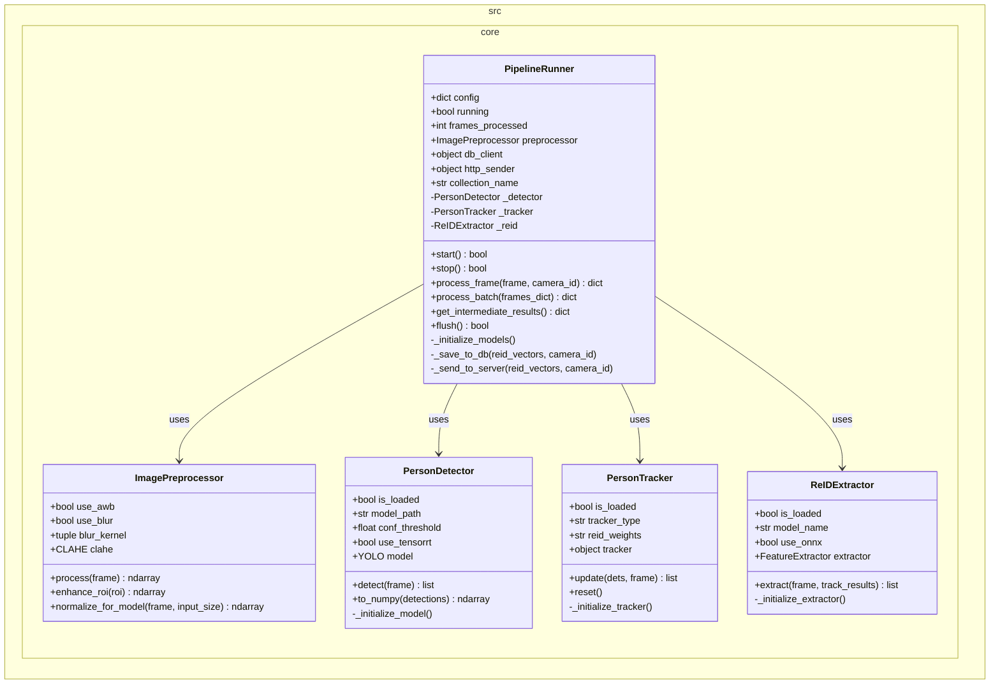
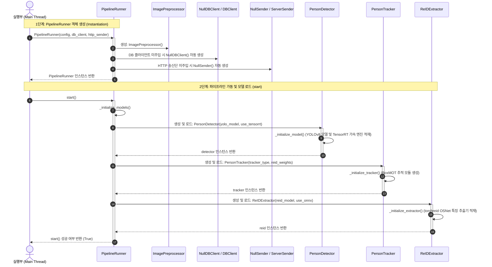
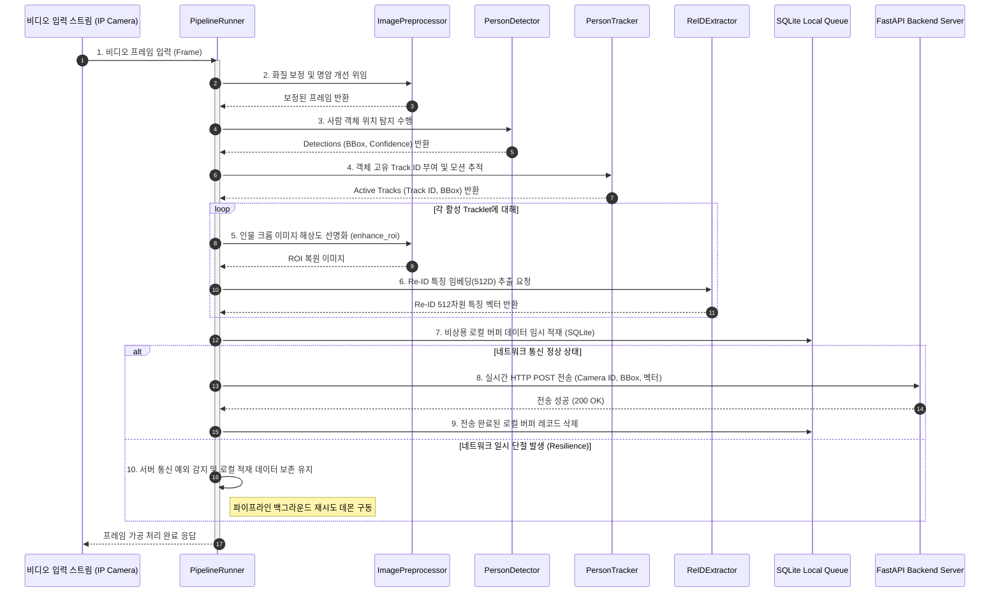
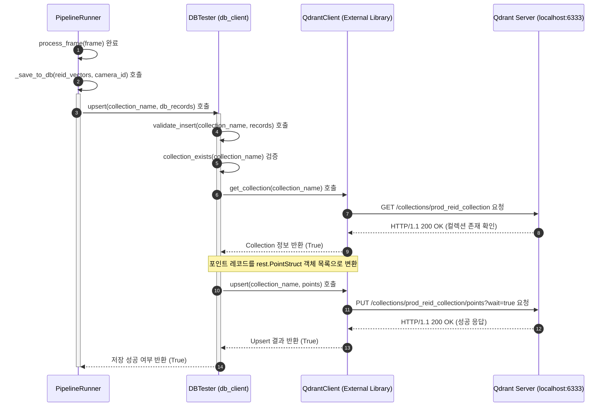

# EYE-D Edge Zone Architecture & Technical Documentation (종합 설명서)

본 문서는 **EYE-D** 시스템의 현장 카메라 및 임베디드 단(Edge Device, 예: Jetson Orin Nano)에서 실시간으로 사람을 탐지하고, 추적하며, 특징 벡터(Re-ID Embedding)를 추출하여 로컬 데이터베이스와 서버로 전송하는 **Edge Zone AI 파이프라인**의 전체 아키텍처와 주요 동작 메커니즘을 설명하는 종합 기술 문서입니다.

---

## 1. High-Level System Architecture (전체 컴포넌트 구조)

Edge Zone 파이프라인은 크게 영상 프레임의 보정과 딥러닝 추론을 담당하는 **Core Video Pipeline**과 분석 데이터의 집계 및 저장/전송을 담당하는 **Analytics & Infrastructure**로 분류됩니다.

---

## 2. Core Video Pipeline & Major Classes (주요 클래스 설명)

### 2.1. 클래스 다이어그램 (Core & Infra 상세)

### 2.2. 주요 클래스별 기능 및 역할

1. **`PipelineRunner` (실행 오케스트레이션)**
   * **역할**: 비디오 입력 소스로부터 들어오는 프레임을 받아 `전처리 ➔ 객체 탐지 ➔ 객체 추적 ➔ Re-ID 임베딩 추출 ➔ 로컬 DB 저장 및 서버 전송`으로 이어지는 파이프라인의 생명주기와 전 과정을 총괄 연동하는 중앙 지휘관 클래스입니다.
   * **핵심 강점**: 모델 로딩 상태를 내부 플래그로 격리 관리하며, DB 연동 실패나 네트워크 장단절 시에도 추론 루프가 붕괴되지 않고 정상 유지되는 견고성을 제공합니다.

2. **`ImagePreprocessor` (지능형 화질 보정 엔진)**
   * **역할**: 엣지 카메라의 악조건(야간 저조도, 광량 대비가 극심한 역광, CCTV 저해상도 뭉개짐)을 극복하기 위해 입력 프레임 및 ROI(인물 검출 영역)를 수학적으로 보정합니다.
   * **주요 기법**:
     * **적응형 감마 변환 (Adaptive Gamma Correction)**: 야간 저조도 환경에서 프레임의 전체 조도를 고속 향상시킵니다.
     * **동적 clipLimit CLAHE**: 역광 환경에서 과노출/과소노출된 얼굴 및 신체 윤곽 부분의 국소 대비를 향상시킵니다.
     * **ROI Unsharp Masking (`enhance_roi`)**: Re-ID 임베딩 추출 직전, 저화질 ROI 이미지를 돋보기로 보듯이 선명화(34% 이상 복원)하여 벡터 식별력을 최대로 끌어올립니다.

3. **`PersonDetector` (고속 객체 탐지)**
   * **역할**: 전처리된 영상에서 보행자(Person)의 존재 유무 및 Bounding Box(BBox)를 실시간으로 탐지합니다.
   * **기반 기술**: Ultralytics YOLOv8을 기본으로 활용하며, Jetson 환경에서 추론 프레임 레이트(FPS) 향상을 극대화하기 위해 NVIDIA GPU 전용 하드웨어 가속 기법인 **TensorRT(FP16)** 변환 엔진을 자동 적재합니다.

4. **`PersonTracker` (인격 동일 신원 추적)**
   * **역할**: YOLOv8 탐지 결과를 활용하여, 여러 프레임에 걸쳐 등장하는 동일 보행자에게 일관된 `Track ID`를 임시 부여합니다.
   * **기반 기술**: 다양한 트래커 인터페이스(ByteTrack, BotSORT 등)와 호환되는 BoxMOT 라이브러리를 바인딩해 활용하며, 단절 후 재매칭을 최소화하기 위해 칼만 필터 및 모션 예측 데이터를 최적 연동합니다.

5. **`ReIDExtractor` (512차원 특징 임베딩 추출)**
   * **역할**: 추적 엔진이 확정한 인물 영역(BBox ROI)만 정밀 크롭하여 Deep Learning 기반 Re-ID 모델(OSNet)에 통과시킨 뒤, 사람의 외형적 의복 특징 및 고유 패턴을 대표하는 **512차원의 고밀도 벡터**를 추출합니다.
   * **가속 기술**: PyTorch 기반의 순수 추론 방식과 비교해 CPU/GPU 실행 속도를 획기적으로 향상시킬 수 있는 **ONNX Runtime 하드웨어 가속** 기술을 통합 탑재했습니다. 라이브러리가 없는 환경에선 PyTorch 백엔드로 부드럽게 되돌아가는 **Fallback 안전 장치**를 내장하고 있습니다.

---

## 3. Sequence Diagrams (주요 동작 시퀀스)

### 3.1. 객체 초기화 및 모델 적재 시퀀스 (Initialization Sequence)

`PipelineRunner`는 자원의 낭비를 줄이고 시스템의 실패 확률을 통제하기 위해, 껍데기 인스턴스를 빠르게 할당하는 `__init__` 단계와 고용량 딥러닝 가중치를 올리는 `start()` 단계를 완전히 분리했습니다.

### 3.2. 비디오 프레임 처리 및 전송 시퀀스 (Processing & Sending Sequence)

영상이 지속적으로 입력될 때 파이프라인 내부에서 프레임이 가공 및 전달되는 흐름입니다. 네트워크에 장애가 발생할 시 SQLite 기반 로컬 큐에 임시 적재되어 데이터 안전을 도모합니다.

### 3.3. 로컬 Qdrant 벡터 DB 적재 시퀀스 (Local Vector DB Upsert Sequence)

파이프라인 실행 중 로컬 Qdrant 데이터베이스에 특징 벡터와 메타데이터가 적재되는 API 호출 및 연결성 검증 상세 흐름입니다.

#### 상세 동작 원리 및 REST API 매핑

파이프라인이 매 프레임을 처리하여 벡터를 저장할 때 발생하는 내부 로직과 Qdrant 서버의 HTTP 통신 로그는 다음과 같이 1:1로 대응됩니다.

1. **컬렉션 존재 유무 검증 (GET 요청)**
   * **Qdrant 통신 로그**: `GET http://localhost:6333/collections/prod_reid_collection`
   * **설명**: `PipelineRunner`가 `_save_to_db`를 거쳐 `DBTester.upsert()`를 호출하면, 데이터를 저장하기 전에 해당 컬렉션이 DB에 등록되어 있는지 검사하기 위해 `DBTester.collection_exists()`를 먼저 실행합니다. 내부적으로 `self.client.get_collection()`이 가동되며 Qdrant 서버로 컬렉션의 정보 조회를 요청합니다.
   
2. **벡터 및 메타데이터 적재 (PUT 요청)**
   * **Qdrant 통신 로그**: `PUT http://localhost:6333/collections/prod_reid_collection/points?wait=true`
   * **설명**: 컬렉션 존재 여부가 확인된 후, 512차원 Re-ID 임베딩 벡터와 카메라 ID, 트랙 ID, 타임스탬프 등의 정보가 결합된 포인트 데이터들을 `rest.PointStruct` 객체 목록으로 가공합니다. 최종적으로 `self.client.upsert()`가 실행되면서 Qdrant의 포인트 적재 REST API를 `PUT` 메소드로 호출하여 데이터를 물리적으로 저장합니다.

#### Qdrant 핵심 용어 설명

Qdrant(벡터 데이터베이스)에서 사용되는 핵심 개념들은 기존 관계형 데이터베이스(RDBMS)의 구성 요소와 다음과 같이 비교할 수 있습니다.

1. **컬렉션 (Collection)**
   * **RDBMS의 테이블(Table)**과 같은 개념입니다.
   * 동일한 벡터 차원(Dimension, 예: 512차원)과 거리 측정 기준(Distance Metric, 예: Cosine)을 공유하는 고밀도 벡터 데이터의 집합소입니다.
   * 본 프로젝트에서는 `prod_reid_collection` 컬렉션을 생성해 Re-ID 특징 벡터를 관리합니다.

2. **포인트 데이터 (Point Data)**
   * **RDBMS의 행(Row) / 레코드(Record)**에 매핑되는 개념입니다.
   * Qdrant에 저장되는 실질적인 데이터 한 줄(단위)을 의미하며, 크게 세 가지 필드로 구성됩니다:
     * **ID**: 포인트의 고유 식별자 (정수 또는 UUID 형식).
     * **Vector**: 고속 탐색을 위한 512차원의 고밀도 실수형 임베딩 배열.
     * **Payload**: 벡터와 연결된 부가 메타데이터 (JSON 형태: `camera_id`, `track_id`, `timestamp` 등).

3. **`rest.PointStruct` 객체**
   * Qdrant 파이썬 SDK가 제공하는 **공식 데이터 전송 구조체 클래스**입니다.
   * 일반 파이썬 딕셔너리(`dict`) 형태의 비정형 데이터를 Qdrant API(`self.client.upsert`)가 강하게 타입 검사할 수 있도록 엄격한 객체 규격으로 감싸서 포장하는 역할을 합니다.

---

## 4. Concurrency Models & Multi-Stream (병렬성 및 다중 스트림 처리)

임베디드 단의 한정된 리소스(예: Jetson Orin Nano의 6x ARM CPU 및 4GB VRAM 제한) 속에서 성능을 극대화하기 위해 3가지 유형의 런타임 오케스트레이터를 구축했습니다.

| 구분 | **PipelineRunner (동기식)** | **ThreadedPipelineRunner (병렬식)** | **MultiStreamPipelineRunner (다중 카메라 공유)** |
| :--- | :--- | :--- | :--- |
| **동작 특징** | 모든 연산이 하나의 루프에서 순차 수행됩니다. | 카메라 입력(I/O), 딥러닝 추론, 서버 전송이 **스레드 3개**로 비동기 병렬화됩니다. | **각 카메라 채널당 개별 스레드**가 프레임을 읽고, 추론은 **단 하나의 공유 GPU 인스턴스**로 큐잉(Queueing) 처리합니다. |
| **대상 소스** | 오프라인 이미지 분석, 단일 비디오 파일 검증 | 웹캠, 단일 IP RTSP 스트림 감시 | 4개 이상의 IP 카메라 스트림 동시 추론 및 감시 |
| **실시간 보장** | 지연 발생 시 영상 전체 재생 속도가 느려짐 | **최신 프레임 보존 Drop 전략**으로 프레임 유실을 동반하더라도 극저지연 실시간성을 강제 보장 | **스레드별 Drop 큐**를 장착하여, 다채널의 디코딩 시간차가 연산 병목을 유발하는 것을 완벽 차단 |
| **VRAM 최적화** | 모델 1세트 로드 (보통) | 모델 1세트 로드 (보통) | **모든 채널이 동일한 YOLO, OSNet 가용 인스턴스를 공유하므로 VRAM 사용량이 채널 수와 무관하게 1대분으로 고정** |
| **사용 사례** | 알고리즘 정밀도 튜닝 및 단위 테스트 | 고성능 단일 스마트 감시용 | 다채널 CCTV 인프라 통합 구축형 |

---

## 5. Network Resilience & Offline Buffering (네트워크 복원력)

엣지 장비는 현장의 무선 통신 장애, 인터넷 패킷 유실 등 불안정한 외부 요인에 노출되기 쉽습니다. EYE-D Edge 파이프라인은 통신 단절에 대처하기 위해 **SQLite 기반 로컬 큐(Resilience Queue)** 방식을 구축했습니다.

1. **상시 기동 버퍼**:
   * 영상에서 추출된 `Camera ID`, `Global Track ID`, `Bounding Box`, `Timestamp`, 그리고 `512차원 Re-ID 임베딩` 데이터를 메모리 유실에 안전한 로컬 디스크 SQLite 큐 테이블에 즉시 밀어 넣습니다.
2. **트랜잭션 기반 전송**:
   * API 서버로 데이터를 무사히 송신하고 `200 OK` 응답을 확인한 레코드만 큐에서 즉각 삭제합니다.
3. **네트워크 장애 감지 및 복구**:
   * 전송 실패 시 파이프라인은 크래시 없이 백그라운드 스레드에서 주기적으로 네트워크 헬스체크 및 재전송(Batch Flush)을 시도합니다. 연결이 복원되면 누적되어 있던 로컬 SQLite 데이터를 서버 스펙에 맞게 다시 고속으로 자동 병렬 전송합니다.

---

## 6. Design Rationale (설계적 결정 및 핵심 근거)

### 6.1. 객체 생성(`__init__`)과 모델 기동(`start`)의 엄격한 분리
* **근거**: 무거운 딥러닝 가중치(OSNet, YOLOv8)의 로드는 인스턴스 선언 단계에서 행할 필요가 없습니다. 단지 객체를 선언하거나 단순 구성을 조회하려는데 무거운 딥러닝 모델이 메모리에 선험적으로 올라가 버리면 비효율적인 시스템 기동 지연과 메모리 낭비가 발생하기 때문입니다. 생성자에서는 가벼운 의존성(Null Object 등)만 빠르게 주입하고, 실제 기동 순간에 모델을 할당 및 검증하는 구조적 지연 로딩(Lazy Loading)을 통해 시스템 견고성을 획기적으로 상승시켰습니다.

### 6.2. 다중 스트림 환경에서의 GPU 인스턴스 공유
* **근거**: 일반적인 구현체는 채널(카메라)마다 파이프라인 객체를 별도로 띄워 GPU 할당을 난발합니다. 그러나 이 방식은 Jetson Orin Nano와 같이 4GB/8GB의 VRAM 제한이 명확한 엣지 보드에서 즉시 GPU Out of Memory (OOM) 오류를 일으킵니다. 이를 방지하고자, 각 IP 카메라는 스레드를 통해 프레임 디코딩만 맡고, 실제 추론 단계에서는 단 하나의 `PersonDetector`와 `ReIDExtractor` 인스턴스를 공유하여 순차적으로 추론 연산을 진행하게 하여 VRAM 오버헤드를 물리적 최소 단위로 억제하였습니다.

### 6.3. 최신 프레임 보존 Drop 전략 (Frame Drop Strategy)
* **근거**: 비디오 추론에서 큐에 쌓인 모든 프레임을 무조건 다 처리하려고 고집하면, 일시적 연산 부하 발생 시 카메라의 실시간 화면보다 수초에서 수십 초 늦게 처리되는 **'지연 누적 현상'**이 일어납니다. 이는 실시간 감시 시스템에서 치명적인 결함입니다. 이를 타파하고자 프레임 큐의 크기를 극도로 짧게(예: 크기 1~2) 유지하고, 새로운 프레임이 올 때 큐가 차 있다면 기존 버퍼의 프레임을 버려버림으로써 언제나 엣지 연산 장치가 **'가장 최신의 실시간 프레임'**만을 처리하도록 강제했습니다.

### 6.4. ONNX 및 TensorRT 가속 파이프라인 채택
* **근거**: 엣지 하드웨어의 저사양 CPU 코어로 딥러닝 추론을 진행하면 실시간 추론(최소 15~30 FPS)이 불가능합니다. 이를 달성하고자 YOLOv8에는 FP16 기반 **TensorRT 가속**을 바인딩하고, OSNet 특징 추출기에는 최적의 CPU/GPU 하드웨어 레지스트리를 타는 **ONNX Runtime 가속**을 동시 적용해 추론 속도를 기존 PyTorch CPU 대비 최대 4~6배 이상 끌어올렸습니다.

---

## 7. Edge Testing & visual Demo Verification (파이프라인 검증 체계)

EYE-D Edge 파이프라인은 기능 구현에만 그치지 않고, 복잡한 하드웨어 환경 및 예외 시나리오를 소프트웨어 수준에서 완벽하게 모증하기 위한 **51개 단위 테스트 세트** 및 **실시간 비주얼 상호작용 데모**를 갖추고 있습니다.

### 7.1. 격리 단위 테스트 구성
`edge/tests/` 하위 폴더에 독립적인 모킹(Mocking) 및 하네스 모듈을 설계하여, GPU가 없거나 로컬 네트워크가 구축되지 않은 격리된 CI/CD 환경에서도 정상적으로 아키텍처 결함을 스캔할 수 있습니다.
* **`test_null_objects.py` (20 passed)**: DB나 서버 통신 장애 상황 시 Null Object가 안전하게 가동되는지 검증
* **`test_pipeline_runner.py` (21 passed)**: 프레임 가공 동기식 루프 및 오케스트레이션 단계별 데이터 연쇄 동작 확인
* **`test_phase2_resilience.py` (4 passed)**: ONNX 가속기 유무에 따른 Fallback 기능 및 데이터 SQLite 임시 유실 대응성 추적
* **`test_phase3_multistream.py` (1 passed)**: 비동기 스레드 풀 환경에서 다채널 IP 카메라 프레임의 자율 분배 및 OOM 회피성 점검
* **`test_phase3_harsh_conditions.py` (3 passed)**: 야간, 역광, 저해상도의 수치 한계치 조건에서 CLAHE, Gamma 변환, Unsharp Masking의 유효 보정성 정밀 분석

### 7.2. 실시간 인터랙티브 데모 (`visual_demo.py`)
개발자가 화면을 보며 실시간으로 알고리즘의 동작성을 실환경 조건에서 분석할 수 있도록, 키보드 입력 인터랙션을 제공하는 시각화 도구입니다.

* **실행**: `python tools/visual_demo.py --video <영상경로>`
* **실시간 단축키 제어판**:
  * **`N` (Night Mode)**: 야간 저조도 모드를 강제로 켜서 적응형 감마 보정력(Gamma LUT) 실시간 비교.
  * **`B` (Backlight Mode)**: 역광 보정 모드를 켜서 명암 차가 높은 부위의 동적 CLAHE 보정력 비교.
  * **`S` (ROI Sharpen Mode)**: 저해상도 ROI 영역의 언샤프 마스킹 선명도 필터(`enhance_roi`) 전후 선명도 복원력 비교.
  * **`Q` 또는 `ESC`**: 윈도우 자원 및 모든 가속 라이브러리를 안전하게 회수하고 기동 정지.
